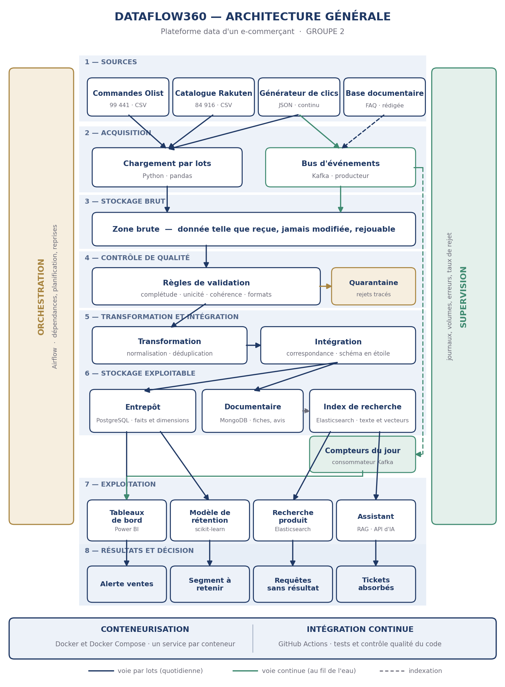

# Yakaarou Diaykaat BI — DataFlow360

**Plateforme data d'un e-commerçant en croissance**
GROUPE 2 · Formation Développement Data, promotion 8 · Orange Digital Center


---

## Le projet

Une entreprise de commerce en ligne produit ses données dans des systèmes séparés et de qualité inégale. Faute d'une vue consolidée et fiable, elle pilote son activité avec plusieurs jours de retard, subit le départ de ses clients sans le comprendre, laisse ses acheteurs échouer dans la recherche produit et sature son service client.

Nous ne construisons pas le site marchand. Nous nous plaçons dans la position de l'équipe data de cette entreprise, et nous construisons sa **plateforme de données** : elle collecte les données dispersées, en contrôle la qualité, les consolide dans un référentiel unique, puis les expose à travers quatre usages.

| # | Besoin | Ce que la plateforme produit |
|---|---|---|
| 1 | Un référentiel unique, contrôlé et fiable | Entrepôt en schéma en étoile, taux de rejet mesuré |
| 2 | Piloter l'activité en quasi temps réel | Tableau de bord et alertes sur les ventes |
| 3 | Anticiper le départ des clients | Probabilité de nouvel achat, segment à retenir |
| 4 | Une recherche produit pertinente | Moteur tolérant aux fautes, filtres par catégorie et prix |
| 5 | Alléger le service client | Assistant répondant à partir d'une base documentaire délimitée |

Le premier besoin conditionne les quatre autres : c'est le socle. Les quatre usages consomment le même référentiel et ne retournent jamais chercher leur donnée à la source.

---

## Architecture



La donnée suit **trois circuits** :

- **Par lots, chaque jour** — commandes, clients, avis et catalogue traversent la zone brute, le contrôle qualité, la transformation et l'intégration, jusqu'à l'entrepôt.
- **En continu** — les événements de navigation passent par le bus d'événements et alimentent directement les compteurs de la journée, **sans passer par l'entrepôt**. C'est la seule voie qui exige une réponse immédiate.
- **Documentaire** — le catalogue nettoyé et la foire aux questions sont indexés pour la recherche produit et pour l'assistant.

### Technologies

| Rôle | Technologie |
|---|---|
| Collecte par lots | Python, pandas |
| Bus d'événements | Kafka |
| Zone brute | Volume Docker partagé |
| Contrôle qualité | Great Expectations |
| Entrepôt analytique | PostgreSQL |
| Base documentaire | MongoDB |
| Recherche lexicale et vectorielle | Elasticsearch |
| Orchestration | Airflow |
| Restitution | Power BI |
| Prédiction | scikit-learn |
| Assistant | API de modèle de langage, génération ancrée dans les documents |
| Conteneurisation | Docker Compose |
| Intégration continue | GitHub Actions |

Chaque choix est justifié, et chaque alternative écartée est expliquée, dans le dossier de conception.

---

## L'équipe

| Membre | Rôle | Périmètre technique | Dossiers |
|---|---|---|---|
| Bachir DEME | Product Owner | Conteneurisation, recherche, Machine Learning et IA | `src/search/`, `src/ml/` |
| Mouhameth DIOP | Scrum Master | Acquisition et flux d'événements | `src/acquisition/`, `src/streaming/` |
| Ndeye Penda SARR | Conception et documentation | Orchestration et restitution décisionnelle | `dags/`, `src/common/` |
| Seydina WADE | Développement | Stockage, qualité des données et intégration continue | `src/quality/`, `.github/workflows/` |
| Aissata DIALLO | Développement | Transformation, intégration et indexation du catalogue | `src/transformation/`, `src/integration/` |

Qui fait quoi, qui décide quoi et qui supplée qui : voir [`docs/ROLES.md`](docs/ROLES.md).

---

## Arborescence

```
Yakaarou_Diaykaat_BI/
├── dags/                    workflows Airflow
├── data/                    données locales — jamais versionnées
│   ├── raw/                 zone brute, donnée telle que reçue
│   ├── quarantine/          enregistrements rejetés par le contrôle qualité
│   └── models/              modèles entraînés
├── docker/
│   ├── app/Dockerfile       image du conteneur de travail
│   └── postgres/init/       création des bases et des schémas au premier démarrage
├── docs/
│   ├── architecture/        schéma d'architecture
│   ├── ROLES.md             rôles et responsabilités
│   ├── PREMIER_COMMIT.md    guide du premier commit
│   └── GUIDE_DEMARRAGE_EQUIPE.md
├── scripts/
│   └── download_data.py     récupération et vérification des données
├── src/
│   ├── common/              configuration partagée
│   ├── acquisition/         chargement par lots, générateur d'événements
│   ├── streaming/           consommateur du flux, compteurs du jour
│   ├── quality/              règles de validation, quarantaine
│   ├── transformation/      normalisation, déduplication, décodage du texte
│   ├── integration/         correspondance des produits, schéma en étoile
│   ├── search/               moteur de recherche
│   └── ml/                  modèle de ré-achat, analyse de sentiment, assistant
├── tests/
├── .env.example             modèle des variables d'environnement
├── CONVENTIONS.md           conventions de travail de l'équipe
├── docker-compose.yml       les six services de la plateforme
├── pyproject.toml
├── requirements.txt
└── requirements-dev.txt
```

Le dossier `data/` n'existe pas après un clonage : il est exclu du dépôt, et créé par le script de récupération des données.


---

## Démarrer la plateforme

### Prérequis

- **Git**
- **Docker Desktop**, **lancé**. Docker Compose doit être en version 2 ou plus : la commande s'écrit `docker compose`, avec une espace.
- **Environ 4 Go de mémoire vive disponibles.** L'ensemble des services en consomme un peu plus de 3 Go une fois démarré, dont environ 1 Go pour Elasticsearch.
- **Une bonne connexion pour le premier lancement** : les images des six services représentent plusieurs gigaoctets.

Inutile d'installer PostgreSQL, MongoDB, Kafka ou Elasticsearch, ni une version particulière de Python : tout tourne dans Docker.

### 1. Récupérer le dépôt

```bash
git clone https://github.com/rassoul01-byte/Yakaarou_Diaykaat_BI.git
cd Yakaarou_Diaykaat_BI
git checkout develop
```

Le travail en cours se trouve sur `develop`. La branche `main` ne reçoit que les versions stables, en fin de sprint.

### 2. Créer son fichier d'environnement

```bash
cp .env.example .env
```

La commande fonctionne aussi sous PowerShell. Le fichier `.env` est propre à chaque poste et ne doit **jamais** être commité.

### 3. Vérifier que les ports sont libres

Si PostgreSQL ou MongoDB sont déjà installés sur votre ordinateur, ils occupent les ports dont la plateforme a besoin.

Sous **Windows**, dans PowerShell :

```powershell
netstat -ano | findstr ":5432 :27017 :9200 :8080 :29092"
```

Sous **Linux** ou **macOS** :

```bash
ss -ltn | grep -E ':(5432|27017|9200|8080|29092)\b'
```

Chaque ligne affichée correspond à un port déjà pris. Changez-le **dans votre `.env`**, jamais dans `docker-compose.yml` :

| Port occupé | Ligne à modifier dans `.env` |
|---|---|
| 5432 | `POSTGRES_PORT=5433` |
| 27017 | `MONGO_PORT=27018` |
| 8080 | `AIRFLOW_PORT=8081` |
| 9200 | `ES_PORT=9201` |
| 29092 | `KAFKA_PORT=29093` |

Sous Windows, modifiez `.env` avec VS Code plutôt qu'avec une commande PowerShell, qui peut changer l'encodage du fichier.

### 4. Lancer

```bash
docker compose up -d --build
```

Patientez deux à trois minutes, puis :

```bash
docker compose ps
```

| Service | État attendu |
|---|---|
| postgres, mongodb | `healthy` |
| elasticsearch, kafka | `healthy` ou `running` |
| airflow-init | **`exited (0)`** |
| airflow-webserver | `healthy` |
| airflow-scheduler, app | `running` |

**`airflow-init` arrêté avec le code 0 est le comportement attendu** : ce service prépare la base d'Airflow puis s'arrête. Le code 0 signifie qu'il a réussi.

### 5. Récupérer les données

Les données ne sont pas dans le dépôt : elles représentent environ 174 Mo. Un script les télécharge depuis l'espace partagé de l'équipe, les range dans la zone brute et vérifie chaque fichier.

```bash
docker compose exec app python scripts/download_data.py
```

Le bilan doit se terminer par **« 10 fichier(s) sur 10 conforme(s) »**. Relancé, le script ne retélécharge rien.

| Option | Effet |
|---|---|
| `--verifier` | vérifie les fichiers présents sans rien télécharger |
| `--forcer` | retélécharge tout, même si tout est conforme |

### 6. Vérifier

```bash
docker compose exec app python -m pytest
```

Les **22 tests** doivent passer.

### Accès aux services

| Service | Adresse par défaut |
|---|---|
| Airflow | http://localhost:8080 — identifiant `admin`, mot de passe `changeme_en_local` |
| Elasticsearch | http://localhost:9200 |
| PostgreSQL | `localhost:5432` — utilisateur `dataflow`, base `dataflow360` |
| MongoDB | `localhost:27017` |
| Kafka | `localhost:29092` |

Si vous avez changé un port dans `.env`, utilisez le vôtre. Les identifiants sont ceux de votre fichier `.env`.

### Arrêter

```bash
docker compose down        # arrête les services, conserve les données
docker compose down -v     # arrête et EFFACE toutes les bases
```

---

## Problèmes fréquents

Toutes ces pannes ont été rencontrées par l'équipe pendant la mise en place.

**`failed to connect to the docker API` ou `dockerDesktopLinuxEngine` introuvable.**
Docker Desktop n'est pas lancé. Ouvrez-le et attendez que son statut indique *Engine running* avant de relancer la commande. La commande `docker version` doit afficher une section `Client` **et** une section `Server`.

**`address already in use` ou `port is already allocated`.**
Un autre programme utilise le port, souvent un PostgreSQL ou un MongoDB installé localement. Changez le port dans `.env`, étape 3.

**`airflow-init` ne se termine jamais ; ses journaux mentionnent `database "airflow" does not exist`.**
La base d'Airflow n'a pas été créée au premier démarrage. Le script de création ne s'exécute que sur une base vide :
```bash
docker compose down -v
docker compose up -d
```

**`Permission non accordée` en écrivant dans `scripts/`, `data/` ou `docker/postgres/` — Linux uniquement.**
Docker a créé le dossier lui-même, en tant qu'administrateur. Reprenez-en la propriété :
```bash
sudo chown -R $USER:$USER <dossier>
```

**`.env.example` introuvable.**
Vérifiez que vous êtes sur `develop` : le fichier n'existe pas sur `main`. S'il a été téléchargé séparément, il a pu perdre son point et s'appeler `env.example` : renommez-le.

**`docker-compose` renvoie une erreur sur le fichier.**
C'est l'ancienne version de l'outil. Utilisez `docker compose`, avec une espace.

**Elasticsearch s'arrête juste après son démarrage, journaux mentionnant `vm.max_map_count`.**
Un réglage système doit être augmenté sur la machine hôte. La procédure est décrite dans la documentation officielle d'Elasticsearch, section *Install Elasticsearch with Docker*.

Pour afficher les journaux d'un service : `docker compose logs --tail 30 <service>`.

---

## Contribuer

Chaque contribution passe par une branche partant de `develop`, puis par une demande de fusion approuvée par un autre membre. Les branches `main` et `develop` sont protégées : aucun envoi direct n'y est possible.

Nommage des branches, messages de commit, demandes de fusion et définition de terminé : voir [`CONVENTIONS.md`](CONVENTIONS.md).

---

## Documentation

| Document | Contenu |
|---|---|
| [`CONVENTIONS.md`](CONVENTIONS.md) | Branches, messages de commit, demandes de fusion, définition de terminé |
| [`docs/ROLES.md`](docs/ROLES.md) | Rôles, responsabilités, décisions et suppléances |
| [`docs/GUIDE_DEMARRAGE_EQUIPE.md`](docs/GUIDE_DEMARRAGE_EQUIPE.md) | Mise à jour des postes et vérification croisée du Sprint 0 |
| [`docs/PREMIER_COMMIT.md`](docs/PREMIER_COMMIT.md) | Guide du premier commit de chaque membre |

---

## Avancement

| Sprint | Objectif | État |
|---|---|---|
| Sprint 0 | Organisation et préparation | En cours — la plateforme démarre et les données sont récupérées |
| Sprint 1 | Acquisition et stockage brut | À venir |
| Sprint 2 | Qualité et transformation | À venir |
| Sprint 3 | Intégration, entrepôt et premiers indicateurs | À venir |
| Sprint 4 | Temps réel, recherche et supervision | À venir |
| Sprint 5 | Intelligence artificielle et finalisation | À venir |

---

## Sources des données

- **Commandes, clients, paiements, livraisons et avis** — Brazilian E-Commerce Public Dataset by Olist, [Kaggle](https://www.kaggle.com/datasets/olistbr/brazilian-ecommerce)
- **Catalogue produits** — Rakuten France Multimodal Product Data Classification, Rakuten Institute of Technology, [Challenge Data ENS](https://challengedata.ens.fr/challenges/35). Les fichiers de fiches et de catégories ont été fusionnés par l'équipe en un fichier unique.
- **Événements de navigation** — générés par l'équipe
- **Base documentaire de support** — rédigée par l'équipe