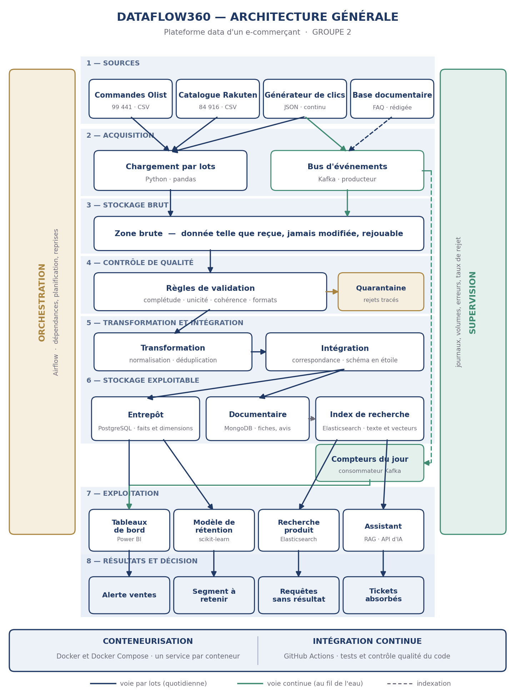

# Dossier de conception — DataFlow360

**Projet :** plateforme data d'un e-commerçant — GROUPE 2, Orange Digital Center, promotion 8
**Dépôt :** <https://github.com/rassoul01-byte/Yakaarou_Diaykaat_BI>
**Période du projet :** réalisation du 16 septembre au 10 octobre 2026, précédée de l'étude du domaine et de la conception de la solution.
**Version :** clôture du Sprint 5. Rédigé le 7 octobre 2026, restructuré le 10 octobre sur les rubriques attendues.
**Statut :** reflète le dépôt tel qu'il est. En cas d'écart avec un contrat de `docs/contrats/`, **le contrat fait foi** et ce dossier est corrigé.

Ce dossier suit l'ordre des rubriques demandées. Chaque section dit ce qui a été conçu, pourquoi, et renvoie au document du dépôt qui porte le détail — il n'y a pas de vérité en double. Les sections 23 à 26 ajoutent ce que les rubriques ne demandent pas et qui décide pourtant de la lecture du projet : les écarts entre le prévu et le réalisé, la dette assumée, et la démonstration.

**Sommaire**

| | Le besoin | | Les traitements |
|---|---|---|---|
| 1 | [Contexte et problème métier](#1-contexte-et-problème-métier) | 9 | [Stratégie de qualité des données](#9-stratégie-de-qualité-des-données) |
| 2 | [Besoins fonctionnels](#2-besoins-fonctionnels) | 10 | [Pipelines ETL / ELT](#10-pipelines-etl--elt) |
| | **Les données** | 11 | [Data Warehouse et BI](#11-data-warehouse-et-bi) |
| 3 | [Sources de données](#3-sources-de-données) | 12 | [Recherche et indexation](#12-recherche-et-indexation) |
| 4 | [Inventaire des données](#4-inventaire-des-données) | 13 | [Batch et streaming](#13-batch-et-streaming) |
| 5 | [Cycle de vie des données](#5-cycle-de-vie-des-données) | 14 | [Monitoring](#14-monitoring) |
| | **L'architecture** | 15 | [Orchestration](#15-orchestration) |
| 6 | [Architecture générale](#6-architecture-générale) | 16 | [Machine Learning et IA](#16-machine-learning-et-ia) |
| 7 | [Flux de données](#7-flux-de-données) | | **L'industrialisation et le projet** |
| 8 | [Choix des systèmes de stockage](#8-choix-des-systèmes-de-stockage) | 17 | [Conteneurisation](#17-conteneurisation-avec-docker) |
| | | 18 | [Stratégie CI/CD](#18-stratégie-cicd) |
| 23 | [Écarts prévu / réalisé](#23-écarts-entre-le-prévu-et-le-réalisé) | 19 | [Organisation de l'équipe](#19-organisation-de-léquipe) |
| 24 | [Décisions structurantes](#24-décisions-de-conception-qui-structurent-la-plateforme) | 20 | [Backlog](#20-backlog) |
| 25 | [Dette technique assumée](#25-dette-technique-assumée) | 21 | [Planning des sprints](#21-planning-des-sprints) |
| 26 | [Démonstration et plan de secours](#26-démonstration-finale-et-plan-de-secours) | 22 | [Répartition des responsabilités](#22-répartition-des-responsabilités) |

---

# I. Le besoin

## 1. Contexte et problème métier

Une entreprise de commerce en ligne en croissance produit ses données dans des systèmes séparés et de qualité inégale : une base de commandes, un catalogue de fiches produits venu d'ailleurs, des avis clients exportés en fichiers, un flux de navigation sur le site. Rien ne les relie.

Quatre conséquences, toutes mesurables :

| Symptôme | Ce qu'il coûte |
|---|---|
| Aucune vue consolidée | L'activité se pilote avec plusieurs jours de retard, sur des chiffres que personne ne sait recouper |
| Le départ des clients n'est pas compris | On découvre qu'un client est parti quand il ne revient plus, donc trop tard pour agir |
| La recherche produit échoue | Un acheteur qui ne trouve pas n'achète pas, et ne le signale jamais |
| Le service client sature | Les mêmes questions reviennent, traitées une par une |

**Ce que nous construisons, et ce que nous ne construisons pas.** Nous ne construisons pas le site marchand. Nous nous plaçons dans la position de l'**équipe data** de cette entreprise : nous collectons les données dispersées, nous en contrôlons la qualité, nous les consolidons dans un référentiel unique, puis nous les exposons à travers quatre usages.

**Les bénéficiaires.** La direction et le pilotage (tableau de bord, alertes), l'équipe marketing (segment de clients à retenir), les acheteurs du site (recherche produit), le service client et les clients eux-mêmes (assistant). Le premier besoin — le référentiel — n'a pas d'utilisateur direct : il conditionne les quatre autres.

---

## 2. Besoins fonctionnels

Les besoins sont numérotés `F<domaine>.<rang>` et cette codification structure tout le projet : les branches Git (`feat/F1.1-collecte-commandes-olist`), les messages de commit, les contrats de `docs/contrats/`, les tests et la répartition des responsabilités du §22 y renvoient.

### 2.1 Les cinq besoins métier

| # | Besoin | Domaine fonctionnel | Ce que la plateforme produit |
|---|---|---|---|
| 1 | Un référentiel unique, contrôlé et fiable | F1 | Entrepôt en schéma en étoile, taux de rejet mesuré, quarantaine consultable |
| 2 | Piloter l'activité en quasi temps réel | F2 | Tableau de bord, compteurs du jour, alerte sur les ventes |
| 3 | Anticiper le départ des clients | F3 | Probabilité de ré-achat, segment de clients à retenir |
| 4 | Une recherche produit pertinente | F4 | Moteur tolérant aux fautes, filtres par catégorie et par langue |
| 5 | Alléger le service client | F5 | Assistant qui sélectionne et cite des passages d'une base délimitée |
| — | *Socle transverse* | F6 | Orchestration, journalisation, conteneurisation, intégration continue |

Le besoin 1 conditionne les quatre autres : c'est le socle. **Les quatre usages consomment le même référentiel et ne retournent jamais chercher leur donnée à la source.** C'est la règle d'architecture qui justifie l'ordre des sprints.

### 2.2 Les besoins détaillés

Les 44 fonctionnalités, par domaine. La colonne « Responsable » est celle du §22 après la révision du Sprint 5 ; la colonne « État » est relevée à la clôture du Sprint 5.

Les libellés sont ceux arrêtés en conception (Partie 2, §5). La colonne « Réalisé par » donne qui a **effectivement** livré, qui diffère du responsable d'origine à presque chaque sprint — le détail et les motifs sont au §21.

**F1 — Référentiel unique, contrôlé et fiable**

| Code | Fonctionnalité attendue | Prio | Prévu | Réalisé par | Sprint | État |
|---|---|---|---|---|---|---|
| F1.1 | Collecter l'historique des commandes, clients, paiements et livraisons depuis les fichiers sources | P1 | MD | MD | S1 | Livré |
| F1.2 | Collecter le catalogue produits et les avis clients | P1 | MD | AD *(catalogue)* et SW *(avis)* | S1 → **S2/S4** | Livré |
| F1.3 | Recevoir en continu les événements de navigation émis par le site | P1 | MD | **NPS** | S1 | Livré |
| F1.4 | Conserver toute donnée entrante dans une zone brute, telle que reçue et non modifiée | P1 | SW | **AD** | S1 | Livré |
| F1.5 | Contrôler la conformité des données avant leur intégration (complétude, unicité, cohérence, format) | P1 | SW | SW | S2 | Livré |
| F1.6 | Placer en quarantaine les enregistrements rejetés en conservant le motif du rejet | P1 | SW | **MD** | S2 | Livré |
| F1.7 | Normaliser les formats : dates, montants, libellés de catégories, casse et accents | P1 | AD | AD | S2 | Livré |
| F1.8 | Dédupliquer les enregistrements sur des clés métier explicites | P1 | AD | AD | S2 | Livré |
| F1.9 | Construire et appliquer la table de correspondance entre produits vendus et fiches du catalogue | P1 | AD | **MD** | S3 | Livré |
| F1.10 | Alimenter le référentiel analytique selon un modèle en schéma en étoile | P1 | AD | AD | S3 | Livré |
| F1.11 | Calculer et exposer le taux de rejet par source et par règle de qualité | P2 | SW | **NPS** | S2 | Livré |

**F2 — Piloter l'activité en quasi temps réel**

| Code | Fonctionnalité attendue | Prio | Prévu | Réalisé par | Sprint | État |
|---|---|---|---|---|---|---|
| F2.1 | Calculer le chiffre d'affaires par jour, semaine et mois | P1 | NPS | **BD** | S3 | Livré |
| F2.2 | Calculer le nombre de commandes et le panier moyen sur ces mêmes périodes | P1 | NPS | **BD** | S3 | Livré |
| F2.3 | Identifier les produits et les catégories les plus vendus | P1 | NPS | **BD** | S3 | Livré |
| F2.4 | Calculer le taux de conversion entre visites et achats | P2 | MD | MD | S4 | Livré, **sur trafic simulé** |
| F2.5 | Maintenir au fil des événements les compteurs de la journée en cours | P1 | MD | MD | S4 | Livré, **sans montant** (§23, E4) |
| F2.6 | Produire un tableau de bord de pilotage destiné au responsable commercial | P1 | NPS | NPS | S3 puis S5 | Livré, 6 pages |
| F2.7 | Déclencher une alerte en cas de chute anormale des ventes ou de rupture | P2 | NPS | NPS | S4 | Livré *(chute des ventes ; pas de rupture)* |

**F3 — Comprendre et anticiper le départ des clients**

| Code | Fonctionnalité attendue | Prio | Prévu | Réalisé par | Sprint | État |
|---|---|---|---|---|---|---|
| F3.1 | Constituer pour chaque client un historique d'achat : récence, fréquence, montant, délais, satisfaction | P2 | AD | **BD** | S5 | Livré |
| F3.2 | Définir la cible de prédiction : probabilité qu'un client effectue un nouvel achat | P2 | BD | **NPS** | S5 | Livré |
| F3.3 | Entraîner un modèle de prédiction sur cette cible | P2 | BD | **NPS** | S5 | Livré |
| F3.4 | Traiter le fort déséquilibre des classes : rééquilibrage et métrique adaptée | P2 | BD | **NPS** | S5 | Livré |
| F3.5 | Évaluer la performance du modèle et documenter explicitement ses limites | P2 | BD | **NPS** | S5 | Livré, **résultat négatif publié** |
| F3.6 | Produire la liste des clients prioritaires pour une action de rétention | **P3** | BD | **NPS** | S5 | Livré *(par la règle, pas par le modèle — §23, E6)* |
| F3.7 | Exporter ce segment dans un format exploitable par l'équipe marketing | **P3** | NPS | NPS | S5 | Livré : vue `dwh.v_segment_a_retenir` |

**F4 — Améliorer la pertinence de la recherche produit**

| Code | Fonctionnalité attendue | Prio | Prévu | Réalisé par | Sprint | État |
|---|---|---|---|---|---|---|
| F4.1 | Indexer le catalogue produits nettoyé | P2 | AD | AD | S4 | Livré |
| F4.2 | Recherche en texte libre tolérante aux fautes de frappe et aux accents | P2 | BD | BD | S4 | Livré |
| F4.3 | Proposer des filtres par catégorie et par gamme de prix | P2 | BD | BD | S4 | Livré **sans le filtre de prix** (§23, E5) |
| F4.4 | Journaliser chaque requête de recherche et le nombre de résultats retournés | P2 | MD | MD | S4 | Livré |
| F4.5 | Identifier les requêtes n'ayant retourné aucun résultat | P2 | BD | BD | S4 | Livré |
| F4.6 | Mesurer l'évolution du taux de requêtes sans résultat après correction du catalogue | **P3** | NPS | NPS | S5 | Livré — *voir la note ci-dessous* |
| F4.7 | Réindexer automatiquement le catalogue après chaque mise à jour | P2 | BD | **AD** *(commande)* et **NPS** *(tâche Airflow)* | S4 | Livré |

> **Note sur F4.6 et F4.7.** Le backlog de conception distingue nettement les deux : F4.6 mesure le taux de requêtes sans résultat, F4.7 réindexe automatiquement. Mais **deux documents du dépôt emploient F4.6 pour la réindexation** — `docs/contrats/index.md` et la répartition du Sprint 4. Les deux fonctions existent bien dans le produit ; c'est le code qui a glissé en cours de route. Le backlog fait foi : les deux documents sont à corriger. C'est le genre d'incohérence qu'un jury relève.

**F5 — Réduire la charge du service client**

| Code | Fonctionnalité attendue | Prio | Prévu | Réalisé par | Sprint | État |
|---|---|---|---|---|---|---|
| F5.1 | Rédiger la foire aux questions : 30 à 50 questions-réponses en cinq thèmes | P2 | SW, AD | SW, AD | S4 | Livré |
| F5.2 | Constituer la base documentaire en associant la FAQ aux fiches produits | P2 | SW | SW | S5 | Livré *(FAQ seule ; voir §25)* |
| F5.3 | Vectoriser et indexer cette base documentaire | P2 | BD | BD | S5 | Livré |
| F5.4 | Retrouver les passages pertinents pour une question posée en langage naturel | P2 | BD | BD | S5 | Livré |
| F5.5 | Générer une réponse construite exclusivement à partir de ces passages | P2 | BD | BD | S5 | Livré — **l'assistant cite, il ne génère pas** (§16.2) |
| F5.6 | Répondre explicitement que l'information n'est pas disponible hors du périmètre | P2 | BD | BD | S5 | Livré |
| F5.7 | Journaliser les questions posées et mesurer le volume traité sans intervention humaine | **P3** | NPS | NPS | S5 | Livré |

**F6 — Fonctionnalités transversales**

| Code | Fonctionnalité attendue | Prio | Prévu | Réalisé par | Sprint | État |
|---|---|---|---|---|---|---|
| F6.1 | Orchestrer l'enchaînement quotidien avec dépendances et reprises | P1 | NPS | **SW** | S3 | Livré, 13 tâches |
| F6.2 | Journaliser chaque exécution : volumes traités, durée, erreurs | P2 | NPS | NPS | S4 | Livré |
| F6.3 | Surveiller la disponibilité des services et le retard du flux d'événements | P2 | NPS | NPS | S4 | Livré |
| F6.4 | Démarrer l'ensemble de la plateforme par conteneurs, en une seule commande | P1 | BD | BD | S0 | Livré |
| F6.5 | Exécuter automatiquement les tests à chaque contribution envoyée | P2 | SW | **BD** | S2 | Livré |

### 2.3 L'écart entre le responsable prévu et celui qui a livré

Sur quarante-quatre fonctionnalités, **quatorze ont changé de mains** en cours de projet. Ce n'est pas un désordre : chaque changement a un motif écrit, et tous sont au §21, sprint par sprint. Trois causes :

| Cause | Fonctionnalités concernées |
|---|---|
| **Équilibrage de charge dans un sprint** — un périmètre concentrait trop de livrables d'un coup | F1.6, F1.11, F6.5 (Sprint 2) ; F1.9 (Sprint 3) |
| **Contrainte matérielle ou de compétence** | F2.1 à F2.3 et F2.6 (Power BI ne tourne que sous Windows) ; F6.1 |
| **Départ d'Aissata DIALLO au Sprint 3**, et un livrable non réalisé par son porteur | F1.4, F3.1, F3.2 à F3.6 |

**La règle appliquée à chaque fois** : le responsable de fond au backlog ne change pas, seule la charge du sprint est partagée, et c'est le responsable de fond qui relit la demande de fusion. C'est ce qui a permis de ne jamais vider un périmètre tout en absorbant les à-coups.

### 2.4 Besoins non fonctionnels

| Exigence | Ce qui la satisfait | Où c'est vérifié |
|---|---|---|
| Rejouabilité | Zone brute immuable, empreintes SHA-256, migrations SQL numérotées et enregistrées | `zone_brute.md`, `scripts/appliquer_sql.py` |
| Atomicité des chargements | Staging, quarantaine et journal écrits dans une seule transaction | `src/quality/chargement.py` |
| Traçabilité | Une ligne de `staging.execution_log` par exécution, motif de rejet conservé | `quarantaine.md` |
| Aucune donnée personnelle dans les journaux | Le journal de l'assistant masque e-mails, téléphones et identifiants avant écriture | `src/assistant/journal.py` |
| Lecture seule pour la restitution | Power BI se connecte par un compte PostgreSQL sans droit d'écriture | `scripts/creer_compte_lecture.py` |
| Démonstration sans Internet | Service référentiel local, sources conservées en zone brute | `referentiel.md` |
| Temps de réponse de la recherche | Mesuré, sous la seconde | `tests/recherche/` |

---

# II. Les données

## 3. Sources de données

### 3.1 Cinq sources de cinq natures différentes, une par membre

C'est une exigence structurante du projet, et non une conséquence : une plateforme data qui ne lirait qu'un seul type de source ne démontrerait rien. Chaque membre porte une nature de source, de bout en bout.

| Nature | Source | Responsable | Livrée au |
|---|---|---|---|
| **SQL** | Base opérationnelle `boutique` — commandes, clients, articles, paiements, vendeurs | Mouhameth DIOP | Sprint 1 |
| **Temps réel** | Générateur et bus d'événements de navigation | Bachir DEME *(générateur)*, Ndeye Penda SARR *(bus)* | Sprint 1 |
| **API** | Service référentiel : jours fériés et taux de change | Ndeye Penda SARR | Sprint 3 |
| **NoSQL** | Catalogue produits servi depuis MongoDB | Aissata DIALLO | Sprint 4 |
| **Fichiers historiques** | Exports d'avis clients | Seydina WADE | Sprint 4 |

Les cinq sont livrées à la fin du Sprint 4. Cette exigence ne se rattrape pas en fin de projet : le Sprint 5 est déjà le plus chargé.

**Un point d'architecture tranché au Sprint 4.** Les avis arrivaient d'abord par la base `boutique`, alors qu'ils constituent la source « fichiers historiques ». `order_reviews` est donc sorti de la base `boutique` et de l'extraction SQL quand la source fichiers a existé — sinon la même donnée serait entrée par deux chemins, et l'argument des cinq sources tombait.

### 3.2 Ce que contient chaque source

| Source | Provenance | Format | Volume | Niveau de qualité constaté |
|---|---|---|---|---|
| Commandes et lignes d'articles | Jeu public **Olist** (Kaggle) | CSV | 99 441 commandes, 112 650 lignes | Bonne. 2 965 dates de livraison manquantes (3,0 %) ; 775 commandes sans ligne |
| Paiements | Olist | CSV | 103 886 lignes | Bonne. 2 961 commandes réglées en plusieurs fois, à agréger avant jointure |
| Clients et géolocalisation | Olist | CSV | 99 441 lignes clients pour **96 096 personnes** ; 1 000 163 lignes de géolocalisation | Faible sur la géolocalisation : 261 831 doublons stricts (26,2 %) |
| Produits et catégories | Olist | CSV | 32 951 produits, 73 catégories | Bonne. 610 produits sans catégorie (1,9 %) |
| Avis clients | Olist | CSV | 99 224 avis, dont 40 977 avec commentaire (41,3 %) | Hétérogène. 814 identifiants dupliqués, 547 commandes à plusieurs avis, texte en portugais |
| Catalogue produits | **Rakuten France** (challenge SIGIR eCom 2020) | CSV | 84 916 fiches, 27 catégories, 53 Mo | Moyenne. 35,1 % sans description ; 63,6 % d'entités HTML ; 62 % de désignations en français |
| Événements de navigation | Générateur de l'équipe | JSON | ≈ 10 000 à 50 000 par journée simulée | Maîtrisée. **Défauts injectés volontairement** pour éprouver la chaîne |
| Base documentaire | Rédigée par l'équipe | JSONL | 30 à 50 questions-réponses, 5 thèmes | Maîtrisée. Couverture volontairement limitée |
| Table de correspondance | Construite par l'équipe | CSV | 32 951 produits à rapprocher | Appariement partiel assumé, les non-appariés tracés |

L'ensemble représente **174 Mo** — 121 Mo pour les commandes, 53 Mo pour le catalogue. Compatible avec la contrainte que l'équipe s'est fixée (tout doit tourner sur des postes de travail), mais interdit de versionner les données : le dépôt n'héberge que le code et le script de récupération. Le jeu de commandes couvre du **4 septembre 2016 au 17 octobre 2018**.

### 3.3 Préparation du catalogue, avant tout usage

Le jeu Rakuten est distribué en trois fichiers. Deux éléments ont été **écartés avant tout usage** :

- **Le fichier de test**, 13 812 fiches, dont les catégories n'ont jamais été publiées. C'est le jeu de soumission du challenge de classification : sans étiquettes, il ne peut alimenter aucun catalogue.
- **Les images produits.** Aucun des cinq besoins ne dépend du visuel, et plusieurs gigaoctets seraient sans contrepartie sur des postes qui font déjà tourner onze services.

Les deux fichiers restants ont été fusionnés en un catalogue unique. Ils partagent un index de 0 à 84 915, vérifié identique ligne à ligne et sans doublon : l'appariement est exact et sans perte. Cette fusion évite qu'un membre manipule séparément l'un des deux fichiers, ce qui romprait la correspondance entre une fiche et sa catégorie **sans provoquer la moindre erreur visible**.

**Aucun nettoyage n'a été appliqué lors de cette fusion** : le fichier obtenu contient la donnée telle que reçue, résidus de balisage compris. Le traitement des défauts relève du pipeline, pas du partage — c'est le principe de la zone brute.

### 3.4 La contrainte qui décide de tout le reste

Les produits vendus (Olist) et les fiches du catalogue (Rakuten) **ne partagent aucun identifiant produit**. Un produit vendu ne peut pas être relié à sa fiche par une clé.

La table de correspondance est donc construite en deux temps : les catégories de produits vendus sont mises en relation avec les 27 catégories du catalogue, puis chaque produit est affecté à une fiche d'une catégorie compatible. **L'appariement est construit par affinité de catégorie, pas par identifiant réel**, et il est déclaré comme tel. Les produits sans catégorie compatible sont rattachés à « inconnu », jamais supprimés.

C'est cette contrainte qui produit trois des écarts du §23 : le rattachement arbitraire (E2), l'absence de montant en temps réel (E4) et l'abandon du filtre de prix (E5). À chaque fois, la plateforme a refusé la solution facile — fabriquer une clé ou un chiffre plausible. **Un chiffre inventé est pire qu'un chiffre absent : il ne se voit pas.**

### 3.5 Trois contraintes identifiées avant la réalisation

**Le ré-achat est rare, et cela change la cible du modèle.** Mesure de l'équipe sur le jeu téléchargé : sur 96 096 personnes, **93 099 n'ont passé qu'une seule commande, soit 96,88 %**. Seules 2 997 ont commandé au moins deux fois, 19 ont atteint cinq commandes, le maximum observé est 17. Prédire un départ de client au sens classique n'aurait aucun sens : la quasi-totalité des clients sont, par construction, dans cet état. Le besoin métier est conservé mais la cible reformulée — on prédit la probabilité d'un **nouvel achat**, pour identifier la minorité sur laquelle une action de rétention est rentable.

**Deux identifiants client de portée différente.** Le jeu comporte un identifiant régénéré à chaque commande (99 441 valeurs) et un identifiant de personne (96 096 valeurs). Toute agrégation sur le premier attribuerait mécaniquement une seule commande à chaque client et priverait le modèle de tout signal — **sans qu'aucune erreur ne se manifeste**. La règle est posée dès la conception : toute agrégation par client s'effectue sur l'identifiant de personne.

**Le catalogue n'est pas intégralement francophone.** Détection sur 3 000 désignations : 62 % de français, 22 % d'anglais, 6,5 % d'allemand. L'ensemble est conservé — c'est le cas réaliste d'une place de marché européenne — et la langue devient un attribut du produit. Plus de 50 000 fiches restent en français, ce qui suffit à démontrer une recherche francophone.

---

## 4. Inventaire des données

### 4.1 Volumes à l'entrée

| Jeu | Lignes | Remarque |
|---|---|---|
| Commandes Olist | 99 224 | dont 96 470 retenues après contrôle |
| Clients Olist | 99 441 | 96 096 personnes distinctes (`customer_unique_id`) |
| Lignes d'articles | 112 650 | |
| Paiements | 103 886 | une commande peut porter plusieurs paiements |
| Avis clients | 99 224 | note et commentaire facultatif |
| Géolocalisation | 1 000 163 | doublons stricts supprimés en contrôle |
| Catalogue Rakuten | 84 916 | 32 951 produits après déduplication |

Ces volumes sont ceux des jeux publics Olist et Rakuten utilisés comme sources. Le total lu par le contrôle qualité est de l'ordre de **1,5 million de lignes** par exécution complète — chiffre qui explique la dette du seuil de rejet au §25.

### 4.2 Tables de la zone intermédiaire (`staging`)

Une table par fichier source, nommée d'après lui, plus les tables de travail de la plateforme.

| Origine | Tables |
|---|---|
| Olist | `olist_orders`, `olist_order_items`, `olist_order_payments`, `olist_order_reviews`, `olist_customers`, `olist_products`, `olist_sellers`, `olist_geolocation`, `product_category_translation` |
| Rakuten | `rakuten_produits` |
| Plateforme | `correspondance_produits`, `execution_log`, `evenements_du_jour`, `journal_assistant`, `retard_flux` |

### 4.3 L'entrepôt (`dwh`)

Schéma en étoile : deux tables de faits, quatre dimensions.

| Table | Nature | Particularité |
|---|---|---|
| `fait_commande` | Fait | Une ligne par commande, montant payé agrégé |
| `fait_ligne_commande` | Fait | Une ligne par article vendu |
| `dim_client` | Dimension historisée (SCD2) | Bâtie sur `customer_unique_id`, la **personne**, jamais `customer_id` |
| `dim_produit` | Dimension historisée (SCD2) | Porte la correspondance et la langue |
| `dim_vendeur` | Dimension historisée (SCD2) | |
| `dim_date` | Dimension fixe | Porte `annee`, `annee_iso`, `semaine_iso`, `trimestre`, `mois` |

Chaque dimension porte une **ligne « inconnu » d'identifiant 0**, permanente, jamais fermée : un fait dont la référence manque y pointe plutôt que d'être perdu. Le détail est dans `contrats/entrepot.md`.

### 4.4 Données sensibles

Aucune donnée personnelle directement identifiante n'est conservée : les jeux sources sont anonymisés à l'origine (identifiants opaques, pas de nom ni d'adresse exacte). Le seul point d'attention est le **journal de l'assistant**, qui enregistre les questions posées : il masque e-mails, numéros de téléphone et identifiants de commande avant écriture (`src/assistant/journal.py`).

---

## 5. Cycle de vie des données

La donnée traverse quatre zones aux règles différentes. Ces règles sont des **engagements**, pas des conventions : elles sont vérifiées par des tests (`tests/quality/test_zones_stockage.py`).

| Zone | Rôle | Règle de vie | Purge |
|---|---|---|---|
| **Zone brute** (`data/raw/`) | La donnée telle que reçue | **Immuable.** Jamais modifiée, jamais corrigée. Empreintes SHA-256 contrôlables | Jamais |
| **Quarantaine** (`quarantaine`) | Les lignes rejetées et leur motif | **Append-only.** Un rejet n'est jamais effacé | Jamais purgée |
| **Zone intermédiaire** (`staging`) | Travail entre contrôle et intégration | **Écrasée** à chaque exécution du pipeline | À chaque exécution |
| **Entrepôt** (`dwh`) | Le référentiel analytique | **Historisé** (SCD2 sur les dimensions), faits rechargés entièrement | Jamais |

**Le point de conception qui compte.** Relancer le contrôle d'une même ingestion **écrase** staging, **n'ajoute pas** une seconde fois les mêmes rejets à la quarantaine, et **ajoute** une ligne au journal. Les trois comportements sont différents parce que les trois zones ont des rôles différents — et chacun est testé.

**Une seule vérité : PostgreSQL.** L'option `--export-csv` écrit une copie d'audit dans `data/audit_qualite/`, que **rien ne relit jamais**. C'est une commodité d'inspection, pas une source.

Le détail complet est dans `contrats/zones_stockage.md` et `contrats/zone_brute.md`.

---

# III. L'architecture

## 6. Architecture générale



La plateforme est organisée en **trois circuits** qui ne se mélangent pas, parce qu'ils n'ont pas les mêmes exigences de délai.

| Circuit | Ce qu'il transporte | Exigence | Passe par l'entrepôt ? |
|---|---|---|---|
| **Par lots, quotidien** | Commandes, clients, avis, catalogue | Exactitude, rejouabilité | Oui |
| **En continu** | Événements de navigation | Réponse immédiate | **Non** |
| **Documentaire** | Catalogue indexé, FAQ vectorisée | Pertinence | Non |

**Pourquoi le flux continu ne passe pas par l'entrepôt.** C'est la seule voie qui exige une réponse immédiate : faire transiter un événement de navigation par le contrôle qualité, la transformation puis le chargement ajouterait des heures de latence à une information qui ne vaut que pour la journée en cours. Les compteurs du jour lisent directement `staging.evenements_du_jour`.

**Le prix de ce choix, et il est assumé.** Les événements n'ont pas le même niveau de contrôle que les lots, et leurs rejets ne sont pas persistés (§25). Les compteurs mesurent donc une **activité**, jamais un chiffre d'affaires.

### Technologies et justification des choix

| Rôle | Technologie | Pourquoi celle-ci |
|---|---|---|
| Collecte par lots | Python, pandas | La manipulation tabulaire est au cœur du métier ; l'équipe la maîtrise |
| Contrôle qualité | **Pandera** | Valide directement les DataFrames pandas, donc au plus près du traitement. *Voir la note E1 au §23* |
| Zone brute | Volume Docker partagé | Pas de dépendance à un service de stockage objet pour une démonstration locale |
| Entrepôt analytique | **PostgreSQL** | Modèle en étoile relationnel, transactions, vues SQL lisibles par Power BI |
| Catalogue produits | **MongoDB** | Documents hétérogènes, champs facultatifs, pas de schéma stable à imposer |
| Recherche | **Elasticsearch** | Tolérance aux fautes (BM25 + analyse) et recherche vectorielle kNN dans le même moteur |
| Vecteurs de texte | fastembed, `paraphrase-multilingual-MiniLM-L12-v2` (384 dim.) | Multilingue, assez léger pour tourner sans GPU |
| Bus d'événements | **Kafka** | Rejeu chronologique possible, découplage producteur/consommateur |
| Orchestration | **Airflow** | Dépendances entre tâches, reprises, journal d'exécution |
| Référentiel | API locale FastAPI | Démonstration sans Internet, chaîne rejouable |
| Prédiction | scikit-learn | Modèle simple, lisible, explicable à un jury |
| Assistant | Python, **sans génération de texte** | Il sélectionne et cite : une réponse est exacte par construction |
| Restitution | Power BI, compte en lecture seule | Attendu du métier ; la lecture seule garantit l'intégrité |
| Conteneurisation | Docker Compose | Un poste neuf démarre la plateforme en une commande |
| Intégration continue | GitHub Actions | Intégrée au dépôt, gratuite pour un projet public |

---

## 7. Flux de données

### 7.1 Circuit par lots

```
data/sources/  ──python -m acquisition [--source rakuten]──▶  data/raw/lots/<source>/ingestion=<id>/   (zone brute + manifeste)
                                                                        │
                                                   python -m quality.controle --source <olist|rakuten> --ingestion <id>
                                                                        │
                                              ┌─────────────────────────┴──────────────────────────┐
                                    lignes valides                                           lignes rejetées (règles bloquantes)
                                              ▼                                                    ▼
                                 PostgreSQL staging.<tables>                          PostgreSQL quarantaine.rejets
                                              │                                                    │
                                              │               staging.execution_log ◀──────────────┘  (une ligne par exécution)
                                              │                          │
                               python -m transformation                python -m quality.rapport --seuil 5
                                 (écrit en place dans staging)
                                              │
                          python -m integration.correspondance
                          python -m integration.chargement   ──▶  entrepôt dwh
                          python -m integration.verifier
```

Trois propriétés de ce circuit sont des décisions, pas des effets de bord :

- **Staging, quarantaine et journal sont écrits dans une seule transaction.** Un échec ne laisse rien à moitié chargé.
- **La transformation se relance après chaque contrôle**, parce que le rechargement de staging remet ses colonnes à NULL.
- **La vérification est une étape à part entière** (`integration.verifier`) : elle recompte les faits et les totaux après chargement. Un entrepôt chargé sans être vérifié n'est pas un entrepôt livré.

### 7.2 Circuit continu

```
générateur ──▶ Kafka (navigation.evenements) ──▶ consommateur ──▶ staging.evenements_du_jour ──▶ vues de compteurs
                        │
                        └──▶ navigation.rebut   (rétention 30 jours, aucun consommateur — voir §25)
```

Le consommateur retient chaque événement **une seule fois** (déduplication par identifiant), ce qui rend le rejeu sans effet de bord.

### 7.3 Circuit documentaire

```
staging (catalogue transformé) ──▶ index Elasticsearch « catalogue »  ──▶ recherche produit
docs/documentaire/faq.jsonl ──▶ passages ──▶ vecteurs (384 dim.) ──▶ index « faq_passages » ──▶ assistant
```

**Point de conception.** L'index de recherche est alimenté depuis `staging` **après transformation**, jamais depuis la zone brute : une fiche encore balisée (`id&eacute;es`) ne doit pas être indexée.

---

## 8. Choix des systèmes de stockage

Quatre systèmes, chacun pour ce qu'il sait faire. Le critère a été : **quelle forme a la donnée, et quelle question lui pose-t-on ?**

| Système | Ce qu'il porte | Pourquoi pas un autre |
|---|---|---|
| **PostgreSQL** | Zone intermédiaire, quarantaine, entrepôt en étoile, journaux | Les questions sont des agrégations sur des jointures : c'est exactement ce qu'un relationnel fait bien. Les vues SQL sont lisibles directement par Power BI, sans couche intermédiaire |
| **MongoDB** | Catalogue produits (source documentaire) | Les fiches ont des champs facultatifs et hétérogènes. Imposer un schéma relationnel aurait créé des colonnes vides et des contraintes fausses |
| **Elasticsearch** | Index du catalogue, index des passages de la FAQ | La tolérance aux fautes et la recherche vectorielle kNN sont natives. Les reproduire en SQL aurait été un projet en soi |
| **Système de fichiers** (volume Docker) | Zone brute, exports d'audit | La zone brute doit être immuable et vérifiable par empreinte. Un fichier l'est naturellement ; une table ne l'est pas |

**Les trois schémas PostgreSQL ne sont pas une commodité d'organisation**, ce sont trois régimes de vie différents (§5) : `quarantaine` n'est jamais purgée, `staging` est écrasée à chaque exécution, `dwh` est historisée. Les séparer rend la règle visible dans le nom de l'objet.

---

# IV. Les traitements

## 9. Stratégie de qualité des données

### 9.1 Le principe

Une ligne qui ne respecte pas une règle **bloquante** n'entre pas dans la zone intermédiaire : elle part en quarantaine **avec son motif**. Elle n'est ni corrigée, ni supprimée, ni silencieusement ignorée. Le motif est consultable, ce qui permet de distinguer une source qui s'est dégradée d'une règle trop stricte.

### 9.2 Les niveaux de gravité

| Gravité | Effet sur la ligne | Exemple |
|---|---|---|
| **Bloquante** | Rejetée, mise en quarantaine avec son motif | Une commande livrée sans date de livraison |
| **Non bloquante** | Conservée, signalée dans le journal | Un produit sans catégorie, rattaché à « inconnu » |
| **Silencieuse** | Supprimée sans rejet | Un doublon strict de géolocalisation |

Ces trois niveaux existent parce que toutes les anomalies ne se valent pas. Supprimer un doublon strict n'est pas rejeter une donnée : rien n'est perdu.

### 9.3 Les règles

Les règles sont déclarées avec **Pandera** et nommées par un code lisible — `OLIST_COMMANDES_02`, `OLIST_CLIENTS_01`, `OLIST_AVIS_03` — qui apparaît dans la sortie du contrôle, en quarantaine et dans le rapport. Parmi les règles qui portent une décision métier :

| Règle | Ce qu'elle impose | Pourquoi |
|---|---|---|
| `OLIST_CLIENTS_01` | Agréger par `customer_unique_id`, jamais par `customer_id` | Un client est une **personne**, pas une commande. 99 441 lignes clients ne représentent que 96 096 personnes |
| `OLIST_COMMANDES_02` | Une commande « delivered » doit porter une date de livraison | Sans elle, tout calcul de délai est faux |
| `OLIST_ARTICLES_02` | Une ligne d'article doit se rattacher à une commande retenue | Évite les faits orphelins dans l'entrepôt |
| `OLIST_AVIS_02` | Une commande ne conserve qu'un seul avis | Un avis dupliqué fausse la note moyenne |

### 9.4 La mesure

Le **taux de rejet** est l'indicateur de la qualité : `lignes rejetées ÷ lignes lues × 100`, par source et par exécution, décliné par règle. Il se consulte par `python -m quality.rapport --seuil 5`. Au-delà de 5 %, le chargement du jour est interrompu et examiné : dans Airflow, c'est un **échec métier**, et la tâche n'est pas rejouée automatiquement.

Sa définition complète, y compris le cas « aucune ligne lue » qui vaut *indéfini* et non zéro, est au dictionnaire des indicateurs.

**Une limite connue et assumée** : le dénominateur est calculé toutes tables confondues. Avec ~1,5 M de lignes lues, franchir 5 % exigerait ~75 000 rejets — le garde-fou ne peut pas se déclencher en pratique (§25).

---

## 10. Pipelines ETL / ELT

La plateforme fait **ELT pour les lots** : extraire, charger en zone intermédiaire, puis transformer en place dans PostgreSQL. Les quatre étapes :

| Étape | Commande | Ce qu'elle fait |
|---|---|---|
| **Acquisition** | `python -m acquisition [--source rakuten]` | Copie la source en zone brute, horodatée, avec un manifeste et des empreintes SHA-256 |
| **Contrôle** | `python -m quality.controle --source <s> --ingestion <id>` | Applique les règles, remplit `staging` et `quarantaine`, écrit une ligne de journal |
| **Transformation** | `python -m transformation` | Normalise, décode le balisage, détecte la langue, déduplique — **écrit en place dans `staging`** |
| **Intégration** | `python -m integration.correspondance`, `.chargement`, `.verifier` | Construit la correspondance produits, charge l'étoile en SCD2, vérifie |

**Pourquoi ELT et non ETL.** Transformer dans PostgreSQL plutôt qu'en mémoire donne trois choses : les transformations sont du SQL relisible par toute l'équipe, l'état intermédiaire est inspectable à chaque étape, et une transformation qui échoue laisse la donnée brute intacte en zone brute.

**L'historisation (SCD2).** Les dimensions `dim_client`, `dim_produit` et `dim_vendeur` conservent leurs versions : une version modifiée est fermée (`valide_au`) et une nouvelle est ouverte. Un rechargement sans changement de source **ne touche à rien** — c'est ce qui garantit l'idempotence, et c'est testé (13 tests dans `tests/integration/test_entrepot_historisation.py`).

---

## 11. Data Warehouse et BI

### 11.1 Le modèle

Schéma en étoile, décrit au §4.3 et détaillé dans `contrats/entrepot.md`. Le choix de l'étoile plutôt que d'un modèle normalisé tient en une phrase : les questions posées sont des agrégations par dimension, et l'étoile est la forme où elles s'écrivent le plus simplement.

### 11.2 Les indicateurs

Tout indicateur publié a une entrée au **dictionnaire des indicateurs** (`docs/dictionnaire_indicateurs.md`, 620 lignes) qui en donne la définition, la formule, la granularité, la source, le calcul et, s'il y a lieu, le seuil d'alerte. **Un chiffre sans entrée au dictionnaire n'est pas publié** — c'est la règle qui a mis deux variables du modèle en dette plutôt que sur le tableau de bord (§25).

Le périmètre du chiffre d'affaires est une décision : il exclut les commandes `canceled` et `unavailable`, et ne comprend pas les frais de port.

### 11.3 La restitution

Tableau de bord Power BI, six pages : Ventes, Produits, Temps réel, Qualité, Segment, Assistant. Il se connecte à PostgreSQL par un **compte en lecture seule** (`scripts/creer_compte_lecture.py`) : l'outil de restitution ne peut rien modifier de l'entrepôt.

Les vues SQL sont l'interface entre l'entrepôt et Power BI. Aucune logique métier ne vit dans le fichier `.pbix` — sauf deux chiffres encore écrits en dur, inscrits en dette et à brancher avant la démonstration (§25).

---

## 12. Recherche et indexation

### 12.1 Recherche produit

Index Elasticsearch du catalogue, alimenté depuis `staging` après transformation. Deux exigences :

- **Tolérance aux fautes** — `chaise de bureu` trouve `chaise de bureau`. La tolérance s'applique à la requête, avec la **première lettre exacte** : `lampe` et `rampe` ne sont distants que d'une lettre, et les confondre ferait plus de mal que de bien.
- **Filtres** — par catégorie et par langue. **Pas de filtre de prix** : le catalogue n'en contient aucun (§23, E5).

Commandes : `python -m recherche.indexer`, `.etat`, `.chercher`, `.sans_resultat`.

### 12.2 Base documentaire de l'assistant

La foire aux questions (`docs/documentaire/faq.jsonl`), répartie en cinq thèmes — livraison, retours, paiement, commande, compte — est découpée en **passages**. Chaque passage est vectorisé (`paraphrase-multilingual-MiniLM-L12-v2`, 384 dimensions) et indexé dans `faq_passages`.

La règle de découpage est dans le contrat : **un passage doit répondre seul**, donc pouvoir être cité seul. C'est ce qui rend une citation honnête.

### 12.3 Ce qui n'est pas mesuré

La pertinence de la recherche produit **n'est pas évaluée** : il existe 6 cas de non-régression et une mesure de latence, mais ni rappel, ni précision@k, ni jeu de jugements. C'est une dette explicite (§25). La recherche documentaire, elle, est mesurée sur un jeu gelé de 62 questions (§16.3).

---

## 13. Batch et streaming

Les deux coexistent, pour des raisons différentes, et ne se rejoignent **jamais** :

| | Batch | Streaming |
|---|---|---|
| Transporte | Commandes, clients, avis, catalogue | Événements de navigation |
| Exigence | Exactitude, rejouabilité | Latence |
| Cadence | Quotidienne (`@daily`) | Continue |
| Contrôle qualité | Complet, avec quarantaine | Déduplication seule |
| Destination | Entrepôt `dwh` | `staging.evenements_du_jour` |
| Ce qu'on en tire | Chiffre d'affaires, segment, indicateurs | Compteurs d'**activité** du jour |

**La règle qui évite la confusion.** Un événement d'achat **ne porte aucun montant**. Les compteurs du jour comptent des actions, pas des euros. Cette mention accompagne tout chiffre affiché, sur le tableau de bord comme en démonstration — sans elle, un lecteur pressé lirait un chiffre d'affaires temps réel qui n'existe pas.

**Le trafic est simulé** (`python -m generateur --debit 20 --duree 300 --graine 42`), avec une graine pour être reproductible. Le générateur produit des requêtes peu réalistes : les compteurs et les requêtes sans résultat sont donc **indicatifs** (§25).

---

## 14. Monitoring

Trois niveaux de surveillance, chacun avec sa commande.

| Niveau | Ce qu'il surveille | Commande | Vues |
|---|---|---|---|
| **Exécutions** | Chaque étape de chaque pipeline : durée, lignes lues/écrites/rejetées, statut | `python -m supervision` | `v_executions`, `v_profil_etapes`, `v_echecs`, `v_volume_par_jour`, `v_derniere_execution` |
| **Retard du flux** | L'écart entre maintenant et le dernier événement reçu | `python -m supervision.surveiller_flux` | `v_retard_courant`, `v_retard_tendance` |
| **Chute des ventes** | L'activité du jour comparée à son habitude, par jour de la semaine | `python -m compteurs.surveiller_ventes` | `v_alerte_ventes` |

**Le socle est `staging.execution_log`** : toute étape de la plateforme y écrit une ligne. C'est ce qui permet de répondre à « qu'est-ce qui a tourné hier, et combien de temps » sans lire un fichier de log.

Quatre corrections récentes des vues de supervision méritent d'être citées, parce qu'elles disent ce qu'est une vue de supervision juste : un statut NULL compte désormais comme un échec (une panne brutale n'écrit pas son statut) ; le volume par jour est calculé en UTC et ne dépend plus du fuseau de la session qui interroge ; les exécutions à égalité d'horodatage sont départagées de la même façon partout. Voir `sql/027_supervision_corrections.sql`.

**Ce qui n'est pas surveillé automatiquement** : ni le flux d'événements ni la supervision ne sont dans un DAG. Ils se lancent à la main (§25).

---

## 15. Orchestration

Le DAG Airflow `quotidien` (`dags/quotidien.py`, exécution `@daily`) enchaîne **13 tâches**. Chacune lance une commande `python -m ...` dans un environnement Python séparé.

```
acquisition ───────────▶ controle_olist ────────┐
                                                ├──▶ rapport_rejet ──▶ transformation ─┬──▶ correspondance ──▶ chargement ──▶ verification ──▶ scores_reachat
acquisition_catalogue ─▶ controle_catalogue ────┘                                      └──▶ reindexation ──▶ etat_index

indexation_passages        (sans dépendance amont : part en même temps que les acquisitions)
```

`indexation_passages` vérifie puis indexe la FAQ ; `scores_reachat` écrit tous les scores de ré-achat après la vérification de l'entrepôt ; `etat_index` compare l'index de recherche à la zone intermédiaire après chaque réindexation.

Trois décisions d'orchestration :

- **Un rapport de rejet au-dessus du seuil est un échec métier**, pas une panne : la tâche n'est pas rejouée automatiquement. Rejouer ne changerait rien, et masquerait le problème.
- **La réindexation du catalogue avance en parallèle du chargement**, pour qu'une indexation lente ne retarde pas les chiffres de vente.
- **Le seuil se règle par une variable Airflow** (`airflow variables set seuil_rejet 5`), pas par une modification du code.

L'entraînement et l'évaluation du modèle (`python -m prediction`) restent **lancés à la main** : un réentraînement quotidien sans surveillance humaine n'aurait pas de sens pour un modèle dont le résultat est négatif.

---

## 16. Machine Learning et IA

Deux briques, de natures opposées : un modèle statistique qui **prédit**, et un assistant qui **ne génère rien**.

### 16.1 Le modèle de ré-achat

**La question.** « Ce client passera-t-il une nouvelle commande dans les 180 jours suivant la date de référence ? », par **personne** (`customer_unique_id`), jamais par commande.

**Le découpage est temporel** : entraînement au 2017-03-31, évaluation au 2017-09-30. L'entraînement ne voit jamais la période d'évaluation. Un découpage aléatoire mélangerait les périodes : le modèle apprendrait ce qu'il doit prédire, et ses résultats seraient excellents et faux. Aucune fonction de découpage aléatoire n'existe dans le code, et un test le vérifie.

**Le déséquilibre est traité par pondération** (`class_weight="balanced"`), sans dupliquer ni supprimer d'exemple. **L'exactitude n'est jamais calculée** : seuls 1,4 à 1,6 % des clients reviennent, donc répondre « il ne reviendra pas » à tout le monde donnerait plus de 95 % d'exactitude et serait inutile.

**Le résultat, publié tel quel** (exécution du 2026-10-07, vraies données) :

| | Rappel | Précision | F1 | Clients signalés |
|---|---|---|---|---|
| Tous négatifs | 0 | 0 | 0 | 0 |
| Deux commandes ou plus | 0,077 | 0,045 | 0,057 | 711 |
| Modèle (seuil 0,5) | 0,324 | 0,021 | 0,039 | 6 503 |

Le modèle **ne bat pas la règle simple** : à 711 clients signalés, il retrouve 18 retours contre 32 pour la règle. Son classement contient un signal faible (13,6 % des retours dans les 10 % du haut, pour 10 % attendus au hasard), pas davantage.

**Conséquence assumée : le segment à retenir est la règle, pas le modèle.** `dwh.v_segment_a_retenir` applique `commandes >= 2` : 711 clients à la date de référence 2017-09-30, dont 32 ont recommandé — 4,5 % de réussite contre 1,58 % au hasard, soit **2,85 fois mieux**. Il ne retrouve que 7,7 % des retours : ce n'est pas une liste de clients perdus.

**Ce qu'il faut dire honnêtement.** La règle existait avant les résultats, mais la décision de la retenir a été prise **après** lecture de l'évaluation. Une seule date d'évaluation a été mesurée, et 75 retours seulement sont disponibles à l'entraînement. L'écart est suggestif, pas démontré. Le protocole complet et les limites sont dans `contrats/modele.md`.

### 16.2 L'assistant

**La décision de conception.** L'assistant **sélectionne et cite** des passages ; il ne génère aucun texte. Une réponse est donc exacte par construction, et une réponse sans citation ne peut pas être construite. C'est le choix qui écarte d'emblée l'hallucination, au prix de ne pas savoir reformuler.

**Trois garde-fous, dans cet ordre :**

1. **Avant la recherche**, des règles déterministes refusent ce que la base ne contiendra jamais : un prix, une commande précise, un remboursement personnalisé.
2. **La recherche** rapporte les passages les plus proches, sans filtre — pour qu'il n'y ait **qu'un seul endroit à régler**.
3. **Après la recherche**, les scores décident : répondre, suggérer sans affirmer, ou refuser et renvoyer au service client.

**Un refus est une réponse correcte**, pas un échec.

### 16.3 Les mesures de l'assistant

Seuils mesurés sur un **jeu gelé** le 2026-10-07 (62 questions, dont 31 couvertes par la base ; empreinte SHA-256 dans `contrats/assistant.md` §6) : réponse 0,84, suggestion 0,20, marge 0,00.

| Mesure | Valeur | Lecture |
|---|---|---|
| Réponses directes correctes | 6 | |
| Refus avec bonne suggestion | 23 | |
| Refus corrects (hors base) | 31 | Un refus justifié est un succès |
| Faux refus | 2 | Passage absent du top 5 : aucun seuil ne les sauve |
| **Mauvais passage** | **0** | |
| **Réponse à tort** | **0** | |

**Ces zéros valent sur ce jeu, pas au-delà.** Les seuils ont été réglés sur lui, et une validation croisée sur deux moitiés a donné une erreur grave pour certains réglages voisins. Le seuil de réponse est à moins de 0,001 d'une erreur connue.

**Le « taux de réponses ancrées » vaut 100 % par construction** : il confirme que le dispositif de citation fonctionne, il ne prouve **ni** la justesse des réponses **ni** la qualité de la recherche. Les chiffres qui renseignent sur celle-ci sont « réponse à tort » et « mauvais passage », qui doivent valoir 0.

**Boucle d'amélioration.** Les questions posées sont journalisées avec leur origine (question libre, suggestion cliquée, reformulation), ce qui alimente `staging.v_reformulations` : les reformulations réelles des utilisateurs deviennent la matière d'une revue humaine de la base documentaire.

---

# V. L'industrialisation

## 17. Conteneurisation avec Docker

Toute la plateforme démarre par `docker compose up -d`. Onze services :

| Service | Image | Rôle |
|---|---|---|
| `postgres` | `postgres:16` | Zones de stockage, entrepôt, journaux |
| `mongodb` | `mongo:7` | Catalogue produits |
| `elasticsearch` | `elasticsearch:8.15.0` | Index catalogue et passages |
| `kafka` | `apache/kafka:3.8.0` | Bus d'événements |
| `airflow-init` | image du projet | Initialise la base de métadonnées d'Airflow, une seule fois |
| `airflow-webserver`, `airflow-scheduler` | image du projet | Orchestration |
| `app` | image du projet | Environnement d'exécution des commandes `python -m ...` |
| `api` | image du projet | API FastAPI (recherche, assistant) |
| `referentiel` | image du projet | Service référentiel local |
| `frontend` | `node:22-alpine` | Application web React |

**Trois choix de composition :**

- **Les versions sont épinglées** dans `.env` (`POSTGRES_VERSION=16`, etc.). `latest` rendrait l'environnement différent d'un poste à l'autre, et une démonstration irreproductible.
- **Chaque port est publié sur `127.0.0.1` uniquement**, jamais sur toutes les interfaces : une base de développement ne doit pas être joignable depuis le réseau.
- **L'initialisation de PostgreSQL est un fichier versionné** (`docker/postgres/init/01-databases.sql`), joué au premier démarrage, qui crée les trois schémas et la table de journal. Les migrations suivantes sont numérotées dans `sql/` et appliquées par `scripts/appliquer_sql.py`, qui enregistre ce qui est déjà passé dans `public.schema_migrations`.

**Un piège rencontré, et corrigé.** La configuration Python lisait des adresses en dur au lieu du `.env` que lit `docker compose`. Sur un poste où `POSTGRES_PORT=5433`, les tests visaient donc le 5432 — c'est-à-dire un PostgreSQL **étranger** au projet. Le danger n'était pas l'échec : si le mot de passe avait concordé, la suite aurait tourné contre la mauvaise base en affichant du vert. `src/common/config.py` lit désormais le `.env`, et `scripts/diagnostic_connexions.py` affiche l'adresse visée **et sa provenance**.

---

## 18. Stratégie CI/CD

L'intégration continue tourne sur **GitHub Actions**, déclenchée à chaque envoi et à chaque demande de fusion vers `develop`. Trois travaux indépendants, qui échouent séparément.

| Travail | Ce qu'il exécute | Pourquoi séparé |
|---|---|---|
| `controle` | `ruff format --check`, `ruff check`, `pytest -m "not integration"` | Les étapes rapides d'abord : on échoue avant de lancer les tests |
| `integration-postgres` | Initialisation de la base, `scripts/appliquer_sql.py`, puis 82 tests d'intégration sur un service PostgreSQL 16 | Une erreur de migration n'est visible que sur une vraie base |
| `frontend` | `npm ci`, `npx tsc --noEmit`, `npm run build` | Une erreur TypeScript ne doit pas masquer un test en échec |

**Pourquoi le travail `integration-postgres` existe.** Il a été ajouté le 10 octobre 2026, après que quatre défauts de migration ont atteint la base du projet **alors que la suite de tests était verte** : `CREATE OR REPLACE VIEW` n'autorise que l'ajout de colonnes en fin de liste, et une colonne déclarée dans le chargement mais absente du schéma cassait tout entrepôt bâti à neuf. Aucun de ces défauts n'était visible sans base de données.

Deux garde-fous complètent ce travail : un **contrôle statique** qui rejoue l'historique des vues sans base (`tests/quality/test_migrations_vues.py`), et un test qui lance **la vraie commande de migration** sur une base jetable (`tests/integration/test_migrations_sur_base_reelle.py`).

**État de la suite à la clôture :** 808 tests unitaires, 82 tests d'intégration PostgreSQL en CI, 42 tests d'intégration restants hors CI (Elasticsearch, Kafka, MinIO) — c'est la dette qui subsiste (§25).

**Règles de contribution** (`CONVENTIONS.md`) : une branche par fonctionnalité, nommée d'après son code de backlog (`feat/F1.1-collecte-commandes-olist`), une demande de fusion relue par un membre d'un **autre** périmètre, et une tâche n'est close que lorsqu'elle est testée, relue, fusionnée et documentée.

**Il n'y a pas de déploiement continu.** La plateforme est livrée comme un dépôt qui démarre en local par Docker Compose ; aucun environnement distant n'est visé. C'est un choix de périmètre, pas un oubli.

---

# VI. Le projet

## 19. Organisation de l'équipe

Cinq membres au départ, quatre à l'arrivée. Le détail fait foi dans [`ROLES.md`](ROLES.md) ; voici ce qui structure le fonctionnement.

| Membre | Rôle de conduite | Périmètre technique |
|---|---|---|
| **Bachir DEME** | Product Owner | Recherche, historique d'achat, assistant |
| **Mouhameth DIOP** | Scrum Master | Acquisition et flux d'événements |
| **Ndeye Penda SARR** | Conception et documentation | Orchestration, restitution décisionnelle, modèle de ré-achat |
| **Seydina WADE** | — | Stockage, qualité des données, base documentaire, intégration continue |
| **Aissata DIALLO** | — *(a quitté le projet au Sprint 3)* | Transformation et intégration |

**Les rôles de conduite s'ajoutent au périmètre technique, ils ne le remplacent pas** : le Product Owner et le Scrum Master développent au même titre que les autres.

### 19.1 Une tâche, un responsable unique

Chaque tâche du backlog porte **un responsable unique**, qui répond de son avancement et saura l'expliquer à la soutenance. Cela ne veut pas dire qu'il travaille seul : chaque sprint mobilise l'équipe entière par la relecture, l'aide au déblocage et les tests. La colonne « Responsable » indique **qui pilote, non qui travaille**.

Cette règle sert la contribution de chacun plutôt qu'elle ne la limite. Si tout le monde touche à tout, l'historique du dépôt ne permet plus de dire ce que chacun a fait, et personne ne peut répondre pour son propre travail.

### 19.2 Qui décide quoi

| Type de décision | Qui tranche |
|---|---|
| Priorité, contenu d'un sprint, acceptation d'une fonctionnalité | Product Owner |
| Abandon d'une tâche de priorité P3 | Product Owner, alerté par le Scrum Master |
| Calendrier, animation, suivi de l'avancement | Scrum Master |
| Choix technique interne à un périmètre | Le responsable du périmètre |
| Choix technique touchant plusieurs périmètres | Décision d'équipe, en réunion |
| Modification de l'architecture ou du dossier de conception | Ndeye Penda SARR, après accord de l'équipe |
| Fusion d'une contribution | Le relecteur de la demande de fusion |

### 19.3 Règles de fonctionnement

- Une réunion en début et en fin de sprint, animée par le Scrum Master ; un point à mi-parcours.
- En fin de sprint, le Scrum Master présente ce qui a été fait, le Product Owner indique ce qui est accepté.
- Toute contribution passe par une branche et une demande de fusion, **relue par un membre d'un autre périmètre**.
- Une carte non mise à jour est considérée comme non commencée.
- **Aucun périmètre n'est étanche** : une séance de restitution mutuelle est organisée avant la soutenance, chaque membre présentant son périmètre aux autres. Le jury pose ses questions au hasard, pas au spécialiste.

---

## 20. Backlog

### 20.1 Où vit le backlog

Le backlog reprend les quarante-quatre fonctionnalités du §2.2, avec pour chacune une priorité, un responsable, une dépendance et un sprint. Il est tenu sur **Trello** par le Product Owner depuis le Sprint 1, en cinq colonnes : À faire, En cours, **En relecture**, Terminé, Bloqué.

> La colonne « En relecture » n'est pas décorative : c'est elle qui rend visible qu'une tâche attend quelqu'un d'autre. Sans elle, tout reste « en cours » pendant des jours.

Chaque carte porte son code `F<domaine>.<rang>` en tête de titre, et ce code se retrouve dans le nom de la branche, les messages de commit, le contrat correspondant et les tests. La liste n'est pas répétée ici : un backlog en double dans deux documents diverge en une semaine.

### 20.2 Les priorités

| Priorité | Signification | Combien | Exemples |
|---|---|---|---|
| **P1** | Indispensable : la plateforme n'a pas de sens sans elle | 17 | F1.5 règles de qualité, F1.10 schéma en étoile, F6.4 conteneurs |
| **P2** | Importante : attendue au terme du projet | 23 | F2.1 indicateurs, F4.2 recherche tolérante aux fautes |
| **P3** | Souhaitable, **abandonnable** si le calendrier se tend | 4 | F3.6, F3.7, F4.6, F5.7 |

Cette hiérarchie a été arrêtée par le Product Owner **dès la conception, à froid, précisément pour ne pas avoir à la décider dans l'urgence du dernier sprint**. Les quatre tâches P3 ont finalement toutes été livrées — F3.6 avec un résultat négatif publié.

### 20.3 L'ordonnancement : ce qui dépend de quoi

Le backlog n'est pas une liste mais une chaîne. Trois enchaînements commandent tout le calendrier :

```
F6.4 conteneurs ──► F1.1 acquisition ──► F1.4 zone brute ──► F1.5 contrôle ──► F1.6 quarantaine ──► F1.11 taux de rejet
                                                                    │
                                                                    └──► F1.7/F1.8 transformation ──► F1.9 correspondance ──► F1.10 étoile
                                                                                                             │
                              F2.1 à F2.3 indicateurs ◄──────────────────────────────────────────────────────┤
                              F3.1 historique ──► F3.2 cible ──► F3.3 modèle ──► F3.4 déséquilibre ──► F3.5 évaluation ──► F3.6 segment
                              F4.1 index ──► F4.2 recherche ──► F4.4 journal ──► F4.5 sans résultat ──► F4.6 mesure
                              F5.1 FAQ ──► F5.2 base ──► F5.3 vecteurs ──► F5.4 passages ──► F5.5 réponse ──► F5.6 refus
```

**La règle qui a permis de ne jamais attendre :** chacun commence par la partie de son livrable qui ne dépend de personne — le contrat, les fonctions pures, leurs tests — et ne branche les autres qu'ensuite. Elle a été appliquée à chaque sprint : le workflow Airflow a été construit avec des tâches factices remplacées une à une, le tableau de bord monté sur une table d'essai aux mêmes colonnes que les vues, le modèle écrit sur un jeu fabriqué de 200 lignes, l'assistant sur cinq passages écrits à la main.

### 20.4 Définition de « terminé »

Une tâche n'est close que lorsqu'elle est **testée, relue, fusionnée et documentée** — pas lorsque le code fonctionne sur le poste de son auteur. En fin de sprint, le Product Owner accepte ou refuse chaque fonctionnalité livrée : *une fonctionnalité qui fonctionne mais ne répond pas au besoin auquel elle est rattachée n'est pas acceptée.*

L'intégration continue (F6.5) automatise deux des cinq points de cette définition, sans que personne ait à y penser.

---

## 21. Planning des sprints

Six sprints, du socle à la finalisation. La règle commune : **chaque sprint livre un ensemble cohérent et démontrable**, jamais une tranche technique isolée. L'objectif est qu'à la fin de chacun, quelque chose fonctionne réellement, plutôt que de découvrir en fin de projet que les composants ne s'assemblent pas.

| Sprint | Objectif, en une phrase | Durée prévue | Durée réelle | Étiquette |
|---|---|---|---|---|
| **0** — Organisation et préparation | Chaque membre clone le dépôt et démarre la plateforme par une seule commande | 1 semaine | **3 jours**, du 16 au 18/09/2026 | — |
| **1** — Acquisition et stockage brut | Une donnée entre dans la plateforme et un événement y circule | 1 semaine | **≤ 3 jours** | `v0.2` |
| **2** — Qualité et transformation | Une donnée invalide est rejetée, son motif est consultable, le taux de rejet s'affiche | 2 semaines | **≤ 3 jours** | — |
| **3** — Intégration, entrepôt, indicateurs | Une commande traverse toute la chaîne, et son chiffre d'affaires s'affiche au tableau de bord | 2 semaines | **≤ 3 jours** | `v0.4` |
| **4** — Temps réel, recherche, supervision | Le chiffre du jour s'affiche sans attendre, une faute de frappe trouve quand même son produit | 2 semaines | **≤ 3 jours** | `v0.5` |
| **5** — Intelligence artificielle et finalisation | La plateforme prédit, répond en citant ses sources, et la démonstration tient en dix minutes | 2 semaines | **≤ 3 jours** | `v1.0` |
| | | **10 semaines** | **25 jours** — 16/09 → 10/10/2026 | |

### 21.0 L'écart de calendrier, et ce qu'il a coûté

**Le planning n'a pas été tenu, et c'est le premier fait à énoncer.** Les durées prévues avaient été établies sur une base de dix heures par semaine et par membre, et annoncées comme « une proposition, à ajuster au calendrier de la formation ». L'ajustement a été brutal : **dix semaines prévues, vingt-cinq jours réels** — un peu plus du tiers. Aucun sprint n'a dépassé trois jours, y compris le Sprint 0, dont le document propre annonçait déjà trois jours au lieu d'une semaine : l'écart commence dès le premier.

Ces vingt-cinq jours ne couvrent que la **réalisation**. Le travail de conception les précède : l'étude du domaine et des sources (Partie 1), puis la conception de la solution (Partie 2) — besoins, architecture, choix technologiques, backlog des 44 fonctionnalités, planification. C'est ce travail préalable qui a rendu la compression tenable : au premier jour du Sprint 0, il n'y avait plus rien à décider sur *quoi* construire, seulement *comment*.

**Ce que cette compression n'a pas entamé.** Les six sprints ont tous atteint leur objectif en une phrase, et les quarante-quatre fonctionnalités sont livrées, y compris les quatre de priorité P3 désignées abandonnables. Aucun périmètre n'a été sacrifié, et cela à quatre personnes au lieu de cinq à partir du Sprint 3.

**Ce qu'elle a coûté, et qui se lit dans la dette du §25.** Trois éléments y sont directement imputables :

| Conséquence | Ce qu'on y voit |
|---|---|
| Le flux d'événements et la supervision ne sont dans **aucun DAG** | L'automatisation a été la première chose repoussée : les commandes existent, leur orchestration non |
| **42 tests d'intégration hors CI**, et aucun avant le 10 octobre | Monter des services dans l'intégration continue coûte une demi-journée qu'aucun sprint de trois jours n'avait |
| La **pertinence de la recherche n'est pas mesurée** | Construire un jeu de jugements demande du temps calme ; il n'y en a pas eu |

**Ce que l'historique du dépôt confirme.** Relevé le 10 octobre 2026 : **333 contributions sur 22 jours actifs**, pour 25 jours calendaires. Trois jours seulement sans aucune contribution — les 18, 19 et 20 septembre, un vendredi et le week-end qui suit, juste après la clôture du Sprint 0.

Le rythme n'est pas régulier, et c'est là que se lit la compression :

| Période | Contributions | Part |
|---|---|---|
| Du 16 au 30 septembre | 85 | 26 % |
| Du 1<sup>er</sup> au 10 octobre | 248 | **74 %** |
| *dont du 4 au 10 octobre* | *191* | ***57 % en sept jours*** |

Les deux journées les plus denses du projet sont le **7 octobre (61 contributions)** et le **8 octobre (48)** — les deux dernières avant la clôture du Sprint 5. Plus de la moitié du dépôt a été écrite dans la dernière semaine. C'est la signature d'un calendrier comprimé, et elle est lisible par quiconque ouvre `git log`.

| Contributeur | Contributions |
|---|---|
| Ndeye Penda SARR | 168 |
| Bachir DEME | 75 |
| Seydina WADE | 61 |
| Aissata DIALLO | 17 *(départ au Sprint 3)* |
| Mouhameth DIOP | 12 |

Ces chiffres se reproduisent par `git shortlog -sne --all` et évoluent à chaque contribution.

Le nombre de contributions n'est pas une mesure de contribution — une migration SQL de cinq lignes et un module de recherche comptent chacun pour un. Il recoupe néanmoins la charge du §22.4 : la personne à 16 fonctionnalités est celle qui a le plus contribué.

> **Un fichier `.mailmap` est nécessaire pour lire ce tableau.** Git identifie un auteur par le couple nom + adresse : une graphie différente ou une seconde adresse crée un contributeur de plus. Le dépôt comptait **neuf identités pour cinq personnes** — deux graphies et trois adresses pour Ndeye Penda SARR, un pseudonyme et l'adresse masquée de GitHub pour Bachir DEME. Le `.mailmap` versionné à la racine rétablit une ligne par personne dans `git shortlog`, `git blame` et la page des contributeurs de GitHub, sans modifier aucun commit. Les noms retenus sont ceux de `ROLES.md`, pour que le dépôt et ce dossier désignent les membres de la même façon.

**Ce qu'il faut en dire au jury.** Un projet mené au tiers du temps prévu produit nécessairement de la dette ; la question n'est pas de savoir s'il y en a, mais si elle est **connue, écrite et assumée** — ou découverte par le correcteur. Elle est au §25, avec sa conséquence et son statut, et trois lignes en sont sorties le 10 octobre.

### 21.1 Sprint 0 — Organisation et préparation

*Le Sprint 0 ne produit aucune fonctionnalité : il met en place ce sans quoi les cinq suivants seraient impossibles. C'est le sprint le plus souvent bâclé, et celui dont le bâclage coûte le plus cher — chaque convention non décidée maintenant sera décidée cinq fois de façon différente par cinq personnes.*

Onze tâches sur trois séances, du 16 au 18 septembre 2026. Deux conditionnent toutes les autres : la réunion d'ouverture, qui tranche les conventions, et la création du dépôt.

| Tâche | Responsable | Séance |
|---|---|---|
| T0.1 Réunion d'ouverture : rôles, conventions, créneaux | Toute l'équipe · MD anime | 1 — 16/09 |
| T0.2 Créer et structurer le dépôt : arborescence, branches, protection | SW | 1 — 16/09 |
| T0.4 Écrire la composition des conteneurs et vérifier le démarrage | BD | 1 et 2 |
| T0.3 Rédiger le fichier des conventions | SW | 2 — 17/09 |
| T0.5 Arrêter et formaliser les rôles et responsabilités | NPS | 2 — 17/09 |
| T0.6 Rédiger le fichier de description du projet | AD | 2 — 17/09 |
| T0.7 Créer le tableau Trello et y verser les 44 cartes | MD · validé par BD | 2 — 17/09 |
| T0.8 Préparer l'environnement Python et le premier test | NPS | 3 — 18/09 |
| T0.9 Déposer les jeux de données hors dépôt et écrire le script de récupération | BD | 3 — 18/09 |
| T0.10 Vérification croisée : chacun clone à froid et démarre | Toute l'équipe | 3 — 18/09 |
| T0.11 Réunion de clôture | MD anime · BD valide | 3 — 18/09 |

**Le critère de fin, et il est inhabituel :** le Sprint 0 s'arrête le jour où **chaque membre** peut cloner le dépôt et démarrer la plateforme par une seule commande. Tant que ce n'est pas vrai pour les cinq, le sprint n'est pas terminé, quelle que soit la date. La vérification se fait en séance, à cinq, et non par déclaration de chacun sur son poste.

### 21.2 Sprint 1 — Acquisition et stockage brut

Livrables : source SQL et son acquisition (MD), générateur d'événements (BD), bus d'événements (NPS), zone brute alimentée et rejouable (AD), trois zones de stockage démarrées (SW).

**Deux décisions prises en cours de sprint :**

- **Séparer `data/sources/` de `data/raw/`.** Le script du Sprint 0 déposait les données directement dans la zone brute, qui ne gardait alors aucune trace de *quand* chaque donnée était entrée — elle en devenait impossible à rejouer proprement.
- **Les cinq sources de natures différentes** (§3.1) deviennent une exigence structurante. Conséquence : le livrable de MD passe de « lire les fichiers CSV » à « extraire par requêtes SQL d'une base opérationnelle », et le catalogue sort de son périmètre.

**Trois réaffectations :** F1.3 de MD vers **NPS** — c'est elle qui surveillera le retard du flux et les alertes, qui passent toutes deux par ce bus ; F1.4 de SW vers **AD** — au Sprint 2, c'est elle qui lira la zone brute pour normaliser ; F1.2 **reportée au Sprint 2**, le catalogue devenant la source NoSQL d'AD et les avis la source fichiers de SW.

### 21.3 Sprint 2 — Qualité et transformation

Livrables : catalogue de règles (SW), quarantaine (MD), taux de rejet (NPS), transformation (AD), intégration continue (BD).

**Le problème de ce sprint, et sa solution.** Trois des cinq livrables relèvent du périmètre de SW, et un quatrième de l'intégration continue, qui est aussi le sien. Appliquer « une fonctionnalité chacun » sans précaution aurait vidé son périmètre. La règle retenue : **SW reste le référent du périmètre qualité, trois de ses fonctionnalités sont portées par d'autres pour ce sprint, et c'est lui qui relit leurs trois demandes de fusion.** Le backlog n'est pas modifié ; seule la charge du sprint est partagée. Cette règle a resservi à chaque sprint suivant.

**La décision technique du sprint : Pandera remplace Great Expectations** (§23, E1).

### 21.4 Sprint 3 — Intégration, entrepôt et premiers indicateurs

Livrables : table de correspondance (MD), modèle en étoile (AD), indicateurs de ventes (BD), tableau de bord (NPS), orchestration (SW), plus la source API (NPS).

**Pourquoi le tableau de bord et les indicateurs ont échangé de mains.** Power BI Desktop n'existe que sous Windows, et la vérification croisée du Sprint 1 est sans appel : quatre membres travaillent sous Linux, Ndeye Penda SARR est la seule sous Windows. L'équipe a décidé de rester sur Power BI, conformément au dossier ; le livrable va donc à la seule personne qui peut le construire, et Bachir DEME prend les indicateurs en échange.

Cet échange a un mérite inattendu : **décider ce qu'on compte est un travail de Product Owner.** Les frais de port entrent-ils dans le chiffre d'affaires ? Une commande annulée compte-t-elle ? Ce sont des questions métier. Bachir les tranche, Ndeye Penda garde la main sur le dictionnaire où elles sont consignées.

**F6.1, l'orchestration, passe à SW** : les modules que le workflow appelle sont pour l'essentiel les siens, et la base de métadonnées d'Airflow vit dans son schéma.

**Le Sprint 3 est le pivot du projet.** Avant lui, la donnée est contrôlée mais pas consolidée ; après lui, les quatre usages ont une base commune à lire. C'est aussi le sprint où **Aissata DIALLO a quitté le projet**, en plein milieu du livrable le plus structurant.

### 21.5 Sprint 4 — Temps réel, recherche et supervision

Livrables : compteurs et journal des requêtes (MD), index et source MongoDB (AD), moteur de recherche (BD), supervision (NPS), source fichiers et FAQ (SW).

**Trois dettes du Sprint 3 traitées dans ce sprint**, déjà diagnostiquées : les vues par règle cumulaient les exécutions (3 219 rejets affichés contre 1 073 réels) ; les droits sur les volumes partagés entre le conteneur applicatif et Airflow ; la couverture du fichier de correspondance, à 36 % des produits, portée à environ 76 % en rattachant les sept catégories les plus lourdes.

**Le risque mémoire, le plus élevé du projet, est levé à ce sprint :** 4,1 Go mesurés pour neuf services avec Airflow en marche, dont 1,6 Go pour Airflow seul et 1,03 Go pour Elasticsearch.

**C'est le sprint où l'exigence des cinq sources est satisfaite** (§3.1) : MongoDB et les fichiers d'avis complètent SQL, temps réel et API.

### 21.6 Sprint 5 — Intelligence artificielle et finalisation

Livrables : variables du modèle (BD), modèle de ré-achat (NPS), base vectorisée (SW), assistant (BD), segment et tableau final (NPS).

**Ce que le départ d'Aissata DIALLO change.** Deux livrables sont redistribués : l'historique d'achat (F3.1) vers Bachir DEME, le modèle (F3.2 à F3.6) vers Ndeye Penda SARR. La conséquence n'est pas seulement une charge déplacée : **les deux chaînes du sprint, parallèles à l'origine, se croisent désormais.**

```
Bachir (variables) ──────► Ndeye Penda (modèle) ──┐
                                                  ├──► Ndeye Penda (segment, ancrage, tableau)
Seydina (base vectorisée) ──► Bachir (assistant) ─┘
```

Bachir est au départ des deux, Ndeye Penda à l'arrivée des deux. **S'il prend du retard sur les variables, tout s'arrête ; si elle prend du retard, rien ne se termine.** Les mesures arrêtées à froid sont au §22.3.

**La moitié de ce sprint n'est pas du développement.** Documentation, dossier de conception à jour, démonstration répétée : c'est ce qui est évalué, et c'est toujours ce qu'on sacrifie en premier. La planification lui réservait la dernière semaine du sprint ; **le sprint ayant duré trois jours, cette réserve n'a pas existé.** La documentation s'est faite après la clôture du code, ce que montre l'historique du dépôt — et ce dossier en est la dernière pièce.

---

## 22. Répartition des responsabilités

### 22.1 Répartition finale

Après la révision du Sprint 5. Le détail et les motifs sont dans [`ROLES.md`](ROLES.md) §4.

| Membre | Ce dont il ou elle répond | Codes | Nombre |
|---|---|---|---|
| **Ndeye Penda SARR** | Orchestration quotidienne et reprises, dictionnaire des indicateurs, tableau de bord, alertes, journalisation, modèle de ré-achat | F2.1, F2.2, F2.3, F2.6, F2.7, F3.2 à F3.7, F4.6, F5.7, F6.1, F6.2, F6.3 | **16** |
| **Bachir DEME** | Composition des conteneurs, recherche et filtres, historique d'achat, chaîne complète de l'assistant | F3.1, F4.2, F4.3, F4.5, F4.7, F5.3 à F5.6, F6.4 | **10** |
| **Seydina WADE** | Zones de stockage, règles de validation, quarantaine, taux de rejet, base documentaire, intégration continue | F1.4, F1.5, F1.6, F1.11, F5.1, F5.2, F6.5 | **7** |
| **Mouhameth DIOP** | Chargement par lots, générateur d'événements, rejeu chronologique, bus, consommateur, compteurs, journal des recherches | F1.1, F1.2, F1.3, F2.4, F2.5, F4.4 | **6** |
| **Aissata DIALLO** | Normalisation, décodage, langue, déduplication, correspondance, schéma en étoile, indexation du catalogue — *livrés avant son départ* | F1.7, F1.8, F1.9, F1.10, F4.1, F5.1 | **6** |

### 22.2 Deux rééquilibrages, et pourquoi

**En conception (Sprint 0).** Le périmètre initial de Bachir DEME comptait dix-neuf fonctionnalités, près du double de tout autre membre. Six tâches périphériques ont été redistribuées, chacune vers le membre dont elle prolonge naturellement le travail : indexer le catalogue va à celle qui le nettoie, journaliser les recherches va à celui qui produit déjà des événements, les mesures vont à celle qui tient le dictionnaire des indicateurs. Bachir conserve le cœur de son périmètre et se trouve déchargé de la plomberie qui l'entoure.

**Au Sprint 5.** Deux livrables changent de responsable :

| Code | Livrable | De → vers | Cause |
|---|---|---|---|
| F3.1 | Historique d'achat et variables du modèle | Aissata DIALLO → Bachir DEME | Départ en cours de projet. Les variables se calculent sur l'entrepôt, que Bachir connaît par ses indicateurs du Sprint 3 |
| F3.2 à F3.6 | Modèle de ré-achat | Mouhameth DIOP → Ndeye Penda SARR | Livrable non réalisé par son porteur prévu. Elle tient le dictionnaire des indicateurs : elle est la mieux placée pour mesurer le modèle honnêtement |

**Le départ d'Aissata DIALLO.** Il est consigné ici et dans `ROLES.md` — il ne se découvre pas à la soutenance. Ce qu'elle avait livré avant de partir reste crédité à son nom. **Quatre personnes livrent le périmètre de cinq : c'est un argument, pas une faiblesse.**

### 22.3 Le point de vigilance, et la mesure prise

Les deux chaînes du Sprint 5 ne sont plus parallèles : **Bachir DEME est au départ des deux** (variables, puis assistant) et **Ndeye Penda SARR à l'arrivée des deux** (modèle, segment, tableau de bord).

| Risque | Mesure arrêtée à froid |
|---|---|
| Retard de Bachir sur les variables : tout s'arrête | Il livre les variables en premier, en trois jours maximum, et alerte au jour 4 |
| Retard de Ndeye Penda : rien ne se termine | Elle avance sur un **jeu fabriqué de 200 lignes aux mêmes colonnes** et sur la documentation, qui ne dépendent de personne ; le branchement est la dernière étape |
| Calendrier tendu | F3.6 (P3) désignée abandonnable, modèle volontairement simple avec bascule vers une règle documentée |
| Documentation sacrifiée en fin de projet | Elle est **dans** le sprint ; la dernière semaine lui est réservée. *Mesure annulée de fait par la durée réelle du sprint : trois jours. La documentation a été faite après la clôture du code* |

Ces dispositions ont été prises **avant** le sprint, pour ne pas avoir à les décider dans l'urgence.

### 22.4 Comment la charge a évolué

| Membre | Périmètre initial | Après rééquilibrage de conception | Après révision du Sprint 5 |
|---|---|---|---|
| Bachir DEME | **19** | 14 | **10** |
| Ndeye Penda SARR | — | 11 | **16** |
| Seydina WADE | — | 7 | 7 |
| Aissata DIALLO | — | 7 | 6 *(livrées avant son départ)* |
| Mouhameth DIOP | — | 6 | 6 |

La charge la plus lourde a changé de personne en cours de projet : elle était sur le Product Owner à la conception, elle est sur la responsable de la documentation à l'arrivée. Les deux fois, le déséquilibre a été **constaté, écrit et traité**, et non subi.

### 22.5 Les risques identifiés en conception, et ce qu'ils sont devenus

| Risque | Niveau | Mesure prise dès la conception | Ce qui s'est passé |
|---|---|---|---|
| **Charge mémoire cumulée des services** | Élevé | Vérification dès le Sprint 0 par BD, relevé transmis à l'équipe, possibilité de ne démarrer que les services nécessaires | **Levé au Sprint 4** : 4,1 Go mesurés pour neuf services, dont 1,6 Go pour Airflow et 1,03 Go pour Elasticsearch |
| **Foire aux questions rédigée trop tard** | Élevé | Placée au Sprint 4 et non au Sprint 5, et confiée à SW et AD, qui ne développent pas l'assistant | **Évité.** La FAQ était prête quand le Sprint 5 a commencé |
| **Concentration des livrables de démonstration** | Moyen | Périmètre de BD ramené de 19 à 14, tâche P3 F3.6 explicitement abandonnable | **Évité**, puis renversé : la concentration s'est déplacée sur NPS au Sprint 5 (§22.3) |
| **Signal faible pour la prédiction du ré-achat** | Moyen | Le livrable attendu est un modèle évalué et documenté, **y compris s'il conclut à une capacité limitée** | **Survenu, et assumé** : le modèle ne bat pas la règle simple, le résultat est publié tel quel (§16.1) |
| **Contribution inégale entre membres** | Moyen | Un responsable unique par tâche, relecture croisée, séance de restitution mutuelle avant la soutenance | **Survenu sous une autre forme** : le départ d'un membre, traité au §22.2 |

Le risque qui s'est réalisé est celui qui avait été anticipé comme « acceptable s'il est honnêtement mesuré ». C'est la raison pour laquelle le résultat négatif du modèle n'a pas mis le projet en difficulté : **la réponse à ce risque avait été décidée avant de connaître le résultat.**

---

# VII. Écarts, dette et soutenance

## 23. Écarts entre le prévu et le réalisé

| # | Prévu | Réalisé | Pourquoi | Où c'est documenté |
|---|---|---|---|---|
| E1 | Contrôle qualité avec Great Expectations | **Pandera** | Décision du Sprint 2, voir la note sous le tableau | `src/quality/controle.py` |
| E2 | Relier les produits vendus (Olist) aux fiches du catalogue (Rakuten) | Rattachement **arbitraire mais déterministe à l'intérieur d'une catégorie** | Les deux jeux ne partagent aucun identifiant produit. Seule la correspondance de catégorie est défendable | `correspondance.md`, `entrepot.md` |
| E3 | Appeler les services publics (jours fériés, taux de change) | **Service référentiel local** qui sert ce qui a été conservé en zone brute | La démonstration fonctionne sans Internet ; la chaîne reste rejouable si un service disparaît | `referentiel.md` |
| E4 | Compteurs du jour avec chiffre d'affaires | **Compteurs d'activité, sans aucun montant** | Un événement d'achat ne porte pas de prix : un chiffre d'affaires en temps réel serait un montant inventé | `sql/015_compteurs_du_jour.sql`, `evenements.md` |
| E5 | Recherche avec filtre de prix | **Filtre de prix abandonné** ; la commande refuse `--prix-min` et `--prix-max` avec un message | Le catalogue ne contient aucun prix, et le lien produit ↔ fiche étant arbitraire (E2), en tirer un prix inventerait un montant | `recherche.md` |
| E6 | Modèle de ré-achat comme base du segment à retenir | **Segment = règle « au moins deux commandes »** ; le modèle reste livré comme résultat négatif | À volume égal (711 clients), la règle retrouve 32 retours, le modèle 18 | §16.1, `modele.md` |
| E7 | Responsabilités du Sprint 5 telles que prévues | **Deux livrables déplacés** | Départ d'Aissata DIALLO ; livrable du modèle repris par Ndeye Penda SARR | §22.2, `ROLES.md` §4.3 |

**Note sur E1 — pourquoi Pandera plutôt que Great Expectations.** La décision a été prise aux jours 1 et 2 du Sprint 2, pour deux raisons.

*Le principal avantage de Great Expectations faisait double emploi.* Son rapport de validation tout fait était l'argument qui l'avait fait retenir en conception. Or le taux de rejet par source et par règle est un livrable du même sprint, produit à partir de la quarantaine et du journal des exécutions. L'avantage tombait, alors que l'installation restait lourde et que l'interface avait beaucoup changé d'une version à l'autre.

*Le besoin était ailleurs.* La question n'est pas « la donnée est-elle conforme ? » mais **quelles lignes ont été rejetées, et pour quelle règle** — puisqu'il faut remplir la quarantaine ligne par ligne, avec un motif. C'est ce que Pandera rend nativement : validation en une passe avec `lazy=True`, et chaque contrôle nommé par l'identifiant de la règle (`error="OLIST_ARTICLES_01"`), qui apparaît alors directement dans le champ `regle` de la quarantaine, sans table de correspondance à écrire.

**Le catalogue de règles reste la seule source de vérité, indépendante de l'outil qui l'exécute.** Si Pandera devait être remplacé, le catalogue, la quarantaine et le taux de rejet ne changeraient pas.

**Une limite commune à E2, E4 et E5.** Ces trois écarts viennent de la même cause : les sources ne se recouvrent pas. Chaque fois, la plateforme a choisi de **ne pas produire un chiffre qu'elle aurait dû inventer**. C'est une position de conception, pas un oubli.

---

## 24. Décisions de conception qui structurent la plateforme

| Décision | Motif | Source |
|---|---|---|
| Trois circuits : lots quotidiens, flux continu, documentaire | Seul le flux d'événements exige une réponse immédiate ; il alimente les compteurs **sans passer par l'entrepôt** | §6 |
| Les usages ne retournent jamais à la source : ils lisent le référentiel | Un seul endroit où la donnée est contrôlée | §6 |
| Zone brute **immuable**, empreintes SHA-256 contrôlables | Rejouabilité et preuve | `zone_brute.md` |
| Staging, quarantaine et journal écrits dans **une seule transaction** | Un échec ne laisse rien à moitié chargé | `src/quality/chargement.py` |
| L'index de recherche est lu depuis staging **après transformation** | Une fiche encore balisée (`id&eacute;es`) ne doit pas être indexée | `index.md` |
| Recherche : première lettre exacte, tolérance aux fautes dans la requête | `lampe` et `rampe` ne sont distants que d'une lettre | `recherche.md` |
| Restitution par un compte PostgreSQL en lecture seule | Power BI ne peut rien modifier | §11.3 |
| Identifiant de **personne** (`customer_unique_id`), jamais de commande | Un client est une personne, pas une commande | `modele.md` |
| Le journal de l'assistant masque e-mails, téléphones et identifiants | Aucune donnée personnelle dans le journal | `src/assistant/journal.py` |
| Un chiffre sans entrée au dictionnaire n'est pas publié | Un indicateur sans définition écrite se réinterprète à chaque lecture | §11.2 |
| L'assistant **sélectionne et cite**, il ne génère rien | Une réponse est exacte par construction | §16.2 |
| Les semaines sont regroupées sur l'**année ISO**, pas l'année civile | Le 1er janvier appartient à la semaine 52 de l'année précédente : les mêler mettrait janvier dans la semaine de Noël | `sql/025_annee_iso.sql` |

---

## 25. Dette technique assumée

Ce qui reste est noté, pas corrigé : le Sprint 5 n'ajoute aucune amélioration des sprints précédents.

| Dette | Conséquence | Statut |
|---|---|---|
| Le flux d'événements et la supervision ne sont dans **aucun DAG** | Le consommateur, l'archivage horaire et la surveillance se lancent à la main | Assumée |
| Les rejets du flux d'événements ne sont **jamais persistés** | Ils partent sur `navigation.rebut`, 30 jours de rétention, sans consommateur : zéro ligne du flux en quarantaine | Assumée, `zones_stockage.md` |
| La pertinence de la recherche produits n'est **pas mesurée** | 6 cas de non-régression et une latence ; ni rappel, ni précision@k, ni jeu de jugements | Assumée |
| Le seuil de rejet se calcule sur un dénominateur **toutes tables confondues** | Avec ~1,5 M de lignes lues, franchir 5 % exigerait ~75 000 rejets : le garde-fou ne peut pas se déclencher | Assumée |
| **42 tests d'intégration hors CI** (Elasticsearch, Kafka, MinIO) | Ils ne tournent qu'en local. *Les 82 tests PostgreSQL sont entrés en CI le 10 octobre* | Réduite, reste partielle |
| Le backlog vivait **uniquement sur Trello** | Les libellés des besoins n'étaient retrouvables nulle part dans le dépôt : les codes y étaient cités, jamais définis | **Corrigée** : les 44 figurent au §2.2 |
| Deux documents emploient **F4.6 pour la réindexation**, que le backlog nomme F4.7 | Ambiguïté sur ce qui a été livré sous ce code | **À corriger** dans `contrats/index.md` et la fiche du Sprint 4 |
| `sql/001` et le Sprint 1 emploient **F1.6 pour les zones de stockage**, que le backlog nomme F1.4 | Même nature : un code réutilisé pour deux choses | **À corriger** |
| Couverture du fichier de correspondance des catégories | Une partie des produits est rattachée à `inconnu` | Assumée |
| Requêtes du générateur d'événements peu réalistes | Les compteurs du jour et les requêtes sans résultat sont indicatifs | Assumée |
| Prix absent du catalogue | Pas de filtre de prix, pas de montant en temps réel (E4, E5) | Assumée, §23 |
| « Délai de livraison moyen » et « note moyenne » absents du dictionnaire | Variables utilisées par le modèle, non publiées comme indicateurs | Inscrits en dette, à valider par le Product Owner |
| Modèle évalué à **une seule date**, 75 retours à l'entraînement | Écarts de quelques points fragiles | Limite écrite dans `modele.md` |
| Tableau de bord : deux chiffres écrits en dur | Le taux d'ancrage de la page « Assistant » et le verdict de l'alerte ne bougeront pas au rafraîchissement | **À brancher avant la démonstration** |
| La base documentaire (F5.2) devait associer la FAQ **aux fiches produits** | Seule la FAQ est vectorisée ; l'assistant ne répond sur aucun produit | Assumée. Le périmètre de l'assistant est la FAQ, et il le dit |

---

## 26. Démonstration finale et plan de secours

Dix minutes, dans l'ordre du parcours de la donnée.

| Qui | Ce qui est montré |
|---|---|
| Seydina | Une donnée entre, une règle la rejette, le motif est consultable |
| Ndeye Penda | La chaîne quotidienne passe au vert dans Airflow ; les compteurs du jour montent pendant que le générateur tourne |
| Bachir | Une recherche avec faute de frappe aboutit ; l'assistant répond en citant ses sources, puis refuse une question hors base |
| Ndeye Penda | Le tableau de bord : ventes, qualité, temps réel, segment à retenir |

**Avant la démonstration.** Plusieurs journées d'événements avec `--debut`, sinon l'alerte sur les ventes ne montre rien. Une recherche à blanc pour réveiller Elasticsearch (première requête : environ une seconde, ensuite dix millisecondes). Le chargement des systèmes sources fait la veille. `python scripts/diagnostic_connexions.py` pour vérifier que les quatre services répondent.

**Si le direct échoue.** Captures et enregistrement : un jury pardonne une panne de réseau, pas l'absence de preuve. La démonstration est répétée au moins deux fois, chronométrée, sur un poste neuf.

**À dire en une phrase.** *Des données brutes de deux systèmes sans identifiant commun, jusqu'à un tableau de bord, un moteur de recherche et un assistant qui cite ses sources.*

---

## Annexe — Où trouver quoi

| Pour | Lire |
|---|---|
| Démarrer la plateforme | [`README.md`](../README.md), [`GUIDE_DEMARRAGE_EQUIPE.md`](GUIDE_DEMARRAGE_EQUIPE.md) |
| La définition d'un indicateur | [`dictionnaire_indicateurs.md`](dictionnaire_indicateurs.md) |
| Les règles d'une zone de stockage | [`contrats/zones_stockage.md`](contrats/zones_stockage.md), [`contrats/zone_brute.md`](contrats/zone_brute.md) |
| Le modèle en étoile | [`contrats/entrepot.md`](contrats/entrepot.md) |
| Le protocole et les limites du modèle | [`contrats/modele.md`](contrats/modele.md) |
| Les garde-fous de l'assistant | [`contrats/assistant.md`](contrats/assistant.md), [`contrats/passages.md`](contrats/passages.md) |
| Qui fait quoi | [`ROLES.md`](ROLES.md) |
| Les conventions de contribution | [`../CONVENTIONS.md`](../CONVENTIONS.md) |
| Ce que contient la version 1.0 | [`NOTE_DE_VERSION_v1.0.md`](NOTE_DE_VERSION_v1.0.md) |
